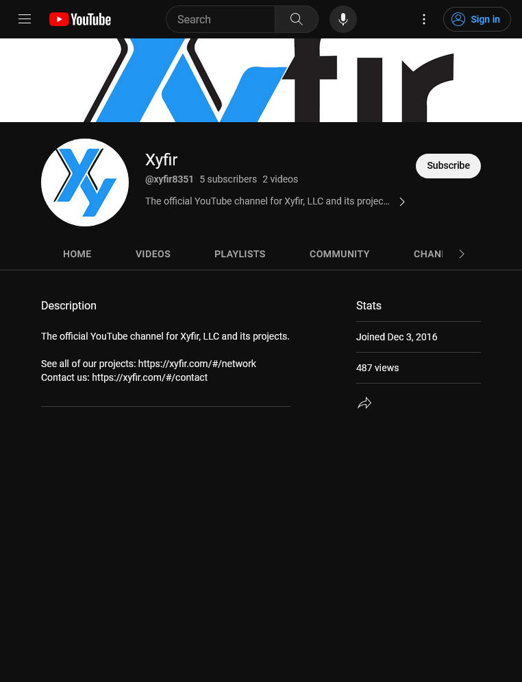
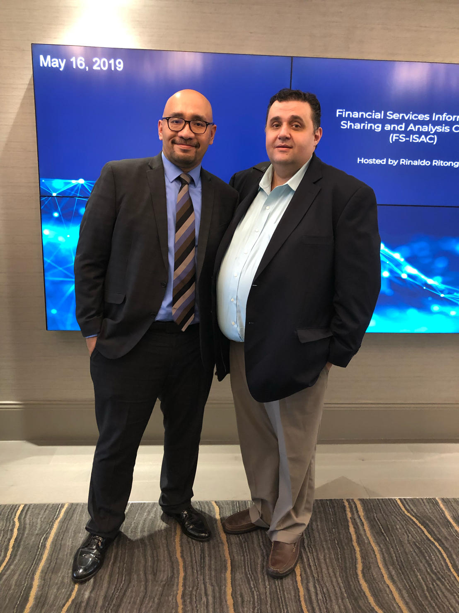
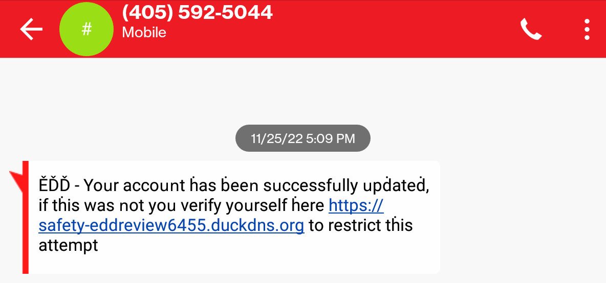
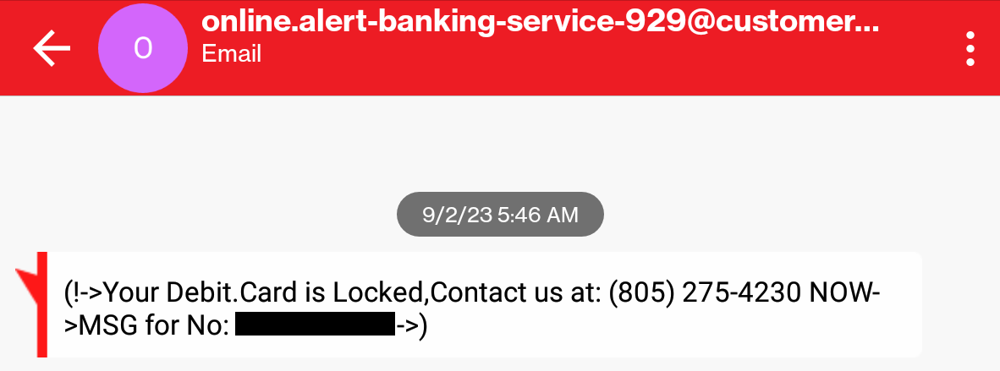

# Fan Mail: Amusing selections from my hate/spam mail.

## An Adorable Attempt at Extortion

### Introduction
> "Be careful what you fish for."
<ul>
	<li>On April 20 2022 I logged into GitHub and saw a notification that on April 18 <a href="https://github.com/MrXyfir" target="_blank">MrXyfir</a> had begun following my account.
	<ul>
		<li>
		

			

Screenshot

			<figure style="margin: 1rem;">
				
			</figure>
		

		</li>
	</ul>
	</li>
	<li>A few days later after logging in again I noticed that <a href="https://github.com/MrXyfir" target="_blank">MrXyfir</a> had unfollowed me.
	</li>
	<li>I thought nothing more of this until 19 days later on May 7 when I received an e-mail from a truly dizzying intellect.
		<ul>
			<li>
			

				
Message Received:

				<ul>
					<li>
						
For full text see: ./messages/MrXyfir.txt

					</li>
					<li>
						

							

Screenshot of e-mail

							<figure style="margin: 1rem;">
								
							</figure>
						

					</li>
				</ul>
			

			</li>
			<li>The first thing which struck me about the e-mail was the sender/return address: mwtheta@mwtheta.net
				<ul>
					<li>Address does not exist which reveals that the skillset of the sender includes spoofing addresses and anonymously sending e-mail.</li>
					<li>Address is a variation on my main Protonmail address which likely indicates that I was targeted personally rather than being just an address in a list.</li>
					<li>Recalling the recent and strange follow/unfollow of <a href="https://github.com/MrXyfir" target="_blank">MrXyfir</a> I checked out their GitHub page and found that one of their pinned repositories is <a href="https://github.com/xyfir/ptorx" target="_blank">ptorx</a> which is owned by <a href="https://github.com/xyfir" target="_blank">xyfir</a> (which they also presumably operate).
						<ul>
							<li>
							

								

Screenshots

								<figure style="margin: 1rem;">
									
									<figcaption>ptorx (GitHub)</figcaption>
								</figure>
								<figure style="margin: 1rem;">
									
									<figcaption>ptorx contributors (GitHub)</figcaption>
								</figure>
							

							</li>
							<li><a href="https://github.com/xyfir/ptorx" target="_blank">ptorx</a> enables users to: "Send and receive mail without using your real email address", "Anonymously forward and send mail with email forwarding and aliases".
							<ul>
								<li><a href="https://www.youtube.com/watch?v=3YmMNpbFjp0" target="_blank">thatwaseasy.mp3</a></li>
							</ul>
							</li>
						</ul>
						</li>
						<li>No other e-mail was received at this Protonmail address for months before/after this message, so it seems reasonable to believe that these events are connected.
						</li>
				</ul>
			</li>
		</ul>
	</li>
	<li>Previous versions of this document show how I went down false paths searching for the likely source, but I am now quite certain that I have found the culprits.
	</li>
	<li>I felt that it would be amusing to publicize this information in the hope that the suspects shit themselves if/when they see this and realize that they <a href="https://www.youtube.com/watch?v=4s0N2aYytjg" target="_blank">dun goofed</a>.
	</li>
	<li>Some information has been publicly omitted but selections are available in encrypted files included in the /encrypted directory.
		<ul>
			<li>If you would like the decryption key then e-mail me with a short message explaining your intentions: mwtheta@protonmail.com
			</li>
		</ul>
	</li>
	<li>I will continue gathering information and updating this repository as long as strange events / attacks continue to occur.
	</li>
	<li>Updates:
		<ul>
			<li>September 17, 2023
				<ul>
					<li>On September 11 I received two new obvious phishing e-mails.
						<ul>
							<li>Same day of previous update to this document.
							</li>
							<li>Two days after first update of this document in nearly a year.
							</li>
							<li>There is a high probability that they came from those who are watching this document for updates.
							</li>
							<li>Screenshots have been added to the Attacks / E-mail section of this document.
							</li>
						</ul>
					</li>
					<li>I remade the screenshot for the initial message in order to show it in full.
					</li>
				</ul>
			</li>
			<li>October 20, 2023
				<ul>
					<li>On October 10 I received another phishing e-mail to my main Protonmail address.
						<ul>
							<li>Due to its close proximity to other attacks I chose to include it in the other/newer main section of this document, but it could be related to past attacks by MrXyfir (& comrade(s)).
							</li>
							<li>The e-mail address is similar to those of two other phishing e-mails I have received: _@_.biglobe.ne.jp.
								<ul>
									<li><a href="https://en.wikipedia.org/wiki/BIGLOBE" target="_blank">BIGLOBE</a> is a Japanese internet service provider.
									</li>
									<li>Recall that <a href="https://github.com/mzch" target="_blank">Koichi Matsumoto</a>, the only other contributor to xyfir/MrXyfir's <a href="https://github.com/xyfir/ptorx" target="_blank">ptorx</a> GitHub repository, is Japanese and may currently live there.
									</li>
								</ul>
							</li>
						</ul>
					</li>
				</ul>
			</li>
		</ul>
	</li>
</ul>

---

### Search
<ul>
	<li>I searched the web for xyfir/MrXyfir and found various accounts on social media as well as other websites, and compiled some lists and screenshots.
		<ul>
			<li>An e-mail address: mr@xyfir.com
				<ul>
					<li>Used to push to repository/ies</li>
					<li>Anything@xyfir.com should reach them since they own the domain.</li>
				</ul>
			</li>
			<li>
				

					

Reddit account: <a href="https://www.reddit.com/user/MrXyfir" target="_blank">https://www.reddit.com/user/MrXyfir</a>

					<ul>
						<li>
							

								

Screenshots

								<figure style="margin: 1rem;">
									
								</figure>
								<figure style="margin: 1rem;">
									
								</figure>
								<figure style="margin: 1rem;">
									
								</figure>
								<figure style="margin: 1rem;">
									
								</figure>
							

						</li>
							<li>Member since January 2, 2016</li>
							<li>Was a moderator of Gift Card Trading (GCTrading) subreddit:  <a href="https://www.reddit.com/r/GCTrading/" target="_blank">https://www.reddit.com/r/GCTrading/</a>
								<ul>
									<li>Type of person who wants to be a Reddit moderator.</li>
								</ul>
							</li>
							<li>Also at least a member (if not also mod) of subreddit Gift Card Trading Rep (GCTRep):  <a href="https://www.reddit.com/r/GCTRep/" target="_blank">https://www.reddit.com/r/GCTRep/</a></li>
							<li>Traded Bitcoin / Amazon balances with other users
							<ul>
								<li><a href="https://www.reddit.com/user/podgoorsky/" target="_blank">https://www.reddit.com/user/podgoorsky/</a></li>
								<li><a href="https://www.reddit.com/user/freshnupwithme/" target="_blank">https://www.reddit.com/user/freshnupwithme/</a></li>
								<li>Stats say ~$3,472 in trades since January 2, 2016</li>
								<li>Indicates knowledge of Bitcoin usage which fits nicely with the e-mail which I received.
								<ul>
									<li><a href="https://github.com/MrXyfir" target="_blank">MrXyfir</a>/<a href="https://github.com/xyfir" target="_blank">xyfir</a> kindly requests "$1370 USD" to be sent to "my bitcoin wallet provided below: bc1q033cjppaea0c2xvw6mwz7c3uf2f3dt9y9ssrx6"</li>
									</li>
								</ul>
								</li>
							</ul>
							</li>
					</ul>
				

			</li>
			<li>
				

					

Fandom accounts

					<ul>
						<li>A Wheel of Time: <a href="https://wot.fandom.com/wiki/User:MrXyfir" target="_blank">https://wot.fandom.com/wiki/User:MrXyfir</a></li>
						<li>Ender's Game: <a href="https://enderverse.fandom.com/f/u/35577581" target="_blank">https://enderverse.fandom.com/f/u/35577581</a></li>
						<li>Kingkiller Series: <a href="https://kingkiller.fandom.com/wiki/User:MrXyfir" target="_blank">https://kingkiller.fandom.com/wiki/User:MrXyfir</a>
						</li>
					</ul>
				

			</li>
			<li>
				

					

Twitter

					<ul>
						<li><a href="https://twitter.com/MrXyfir" target="_blank">https://twitter.com/MrXyfir</a>
						<ul>
							<li>
								

									

Screenshots

									<figure style="margin: 1rem;">
										
										<figcaption>MrXyfir main page details</figcaption>
									</figure>
									<figure style="margin: 1rem;">
										
										<figcaption>MrXyfir Twitter Avatar</figcaption>
									</figure>
									<figure style="margin: 1rem;">
										
										<figcaption>MrXyfir only tweet</figcaption>
									</figure>
									<figure style="margin: 1rem;">
										
										<figcaption>MrXyfir Twitter likes</figcaption>
									</figure>
									<figure style="margin: 1rem;">
										
										<figcaption>MrXyfir only tweet likes</figcaption>
									</figure>
									<figure style="margin: 1rem;">
										
										<figcaption>MrXyfir only tweet likes</figcaption>
									</figure>
									<figure style="margin: 1rem;">
										
										<figcaption>MrXyfir Twitter Followers Part 1</figcaption>
									</figure>
									<figure style="margin: 1rem;">
										
										<figcaption>MrXyfir Twitter Followers Part 2</figcaption>
									</figure>
									<figure style="margin: 1rem;">
										
										<figcaption>MrXyfir Twitter Followers Part 3</figcaption>
									</figure>
									<figure style="margin: 1rem;">
										
										<figcaption>MrXyfir Twitter Followers Part 4</figcaption>
									</figure>
									<figure style="margin: 1rem;">
										
										<figcaption>MrXyfir Twitter Followers Part 5</figcaption>
									</figure>
									<figure style="margin: 1rem;">
										
										<figcaption>MrXyfir Twitter Followers Part 6</figcaption>
									</figure>
									<figure style="margin: 1rem;">
										
										<figcaption>MrXyfir Twitter Followers Part 7</figcaption>
									</figure>
								

							</li>
							<li>Location: California, USA</li>
							<li>Only Tweet: <a href="https://twitter.com/MrXyfir/status/1141013259887108097" target="_blank">https://twitter.com/MrXyfir/status/1141013259887108097</a>
							<ul>
								<li>11 likes
								<ul>
									<li><a href="https://twitter.com/darkpixlz" target="_blank">darkpixlz</a> (furry)</li>
									<li><a href="https://twitter.com/NobleFurLyfe" target="_blank">NobleFurLyfe</a> (furry)</li>
									<li><a href="https://twitter.com/megamastermanu" target="_blank">megamastermanu</a></li>
									<li><a href="https://twitter.com/sha_tiw" target="_blank">sha_tiw</a></li>
									<li><a href="https://twitter.com/Devtubel" target="_blank">Devtubel</a></li>
									<li><a href="https://twitter.com/TomatDividedBy0" target="_blank">TomatDividedBy0</a> ("vaguely ultra-left")</li>
									<li><a href="https://twitter.com/k3llydev" target="_blank">k3llydev</a></li>
									<li><a href="https://twitter.com/lowfry" target="_blank">lowfry</a></li>
									<li><a href="https://twitter.com/PtorxMail" target="_blank">PtorxMail</a> (liked his own tweet)</li>
									<li><a href="https://twitter.com/kojo_Swain" target="_blank">kojo_Swain</a></li>
									<li><a href="https://twitter.com/MrXyfir" target="_blank">MrXyfir</a> (liked his own tweet)</li>
								</ul>
								</li>
							</ul>
							</li>
							<li>Followers: <a href="https://twitter.com/oevrhgczAPcyoNf" target="_blank">oevrhgczAPcyoNf</a>, <a href="https://twitter.com/Soeparmadi" target="_blank">Soeparmadi</a>, <a href="https://twitter.com/dedhex_07" target="_blank">dedhex_07</a>, <a href="https://twitter.com/Cynethic" target="_blank">Cynethic</a>, <a href="https://twitter.com/yeahwemadeout" target="_blank">yeahwemadeout</a>, <a href="https://twitter.com/ditoruncausO" target="_blank">ditoruncausO</a>, <a href="https://twitter.com/Maxx464" target="_blank">Maxx464</a>, <a href="https://twitter.com/TetrAbysmal" target="_blank">TetrAbysmal</a>, <a href="https://twitter.com/NahuelDMt" target="_blank">NahuelDMt</a>, <a href="https://twitter.com/Scdingo1" target="_blank">Scdingo1</a>, <a href="https://twitter.com/blair_pass" target="_blank">blair_pass</a>, <a href="https://twitter.com/czwsaxde" target="_blank">czwsaxde</a>, <a href="https://twitter.com/ItsWilliam77" target="_blank">ItsWilliam77</a>, <a href="https://twitter.com/Ruz60908488" target="_blank">Ruz60908488</a>, <a href="https://twitter.com/NouSomeone" target="_blank">NouSomeone</a>, <a href="https://twitter.com/Emma__McCaw" target="_blank">Emma__McCaw</a>, <a href="https://twitter.com/rootslashbin" target="_blank">rootslashbin</a>, <a href="https://twitter.com/Husky_NZ" target="_blank">Husky_NZ</a>, <a href="https://twitter.com/jonasqalolino" target="_blank">jonasqalolino</a>, <a href="https://twitter.com/whosurkolchan" target="_blank">whosurkolchan</a>, <a href="https://twitter.com/Hel_lmYXX" target="_blank">Hel_lmYXX</a>, <a href="https://twitter.com/edon_palenchar" target="_blank">edon_palenchar</a>, <a href="https://twitter.com/_hopa_" target="_blank">_hopa_</a>, <a href="https://twitter.com/ClownMeebus" target="_blank">ClownMeebus</a>, <a href="https://twitter.com/JoeHan04889221" target="_blank">JoeHan04889221</a>, <a href="https://twitter.com/texaglo_techno" target="_blank">texaglo_techno</a>, <a href="https://twitter.com/MaloneyTyler" target="_blank">MaloneyTyler</a>, <a href="https://twitter.com/bieronym" target="_blank">bieronym</a>, <a href="https://twitter.com/NiklasInde" target="_blank">NiklasInde</a>, <a href="https://twitter.com/k3llydev" target="_blank">k3llydev</a>, <a href="https://twitter.com/jpoiatti" target="_blank">jpoiatti</a>, <a href="https://twitter.com/oivoodoo" target="_blank">oivoodoo</a>, <a href="https://twitter.com/w3debugger" target="_blank">w3debugger</a>, <a href="https://twitter.com/botykai_zsolt" target="_blank">botykai_zsolt</a>, <a href="https://twitter.com/alberto1el" target="_blank">alberto1el</a>, <a href="https://twitter.com/akaash19031973" target="_blank">akaash19031973</a>, <a href="https://twitter.com/flocca" target="_blank">flocca</a>, <a href="https://twitter.com/ivanhigueram" target="_blank">ivanhigueram</a>, <a href="https://twitter.com/Skarlso" target="_blank">Skarlso</a>, <a href="https://twitter.com/m4pp3rr" target="_blank">m4pp3rr</a>, <a href="https://twitter.com/emaraschio" target="_blank">emaraschio</a>, <a href="https://twitter.com/Bocard23" target="_blank">Bocard23</a>, <a href="https://twitter.com/iamshouvikmitra" target="_blank">iamshouvikmitra</a>, <a href="https://twitter.com/hoyes" target="_blank">hoyes</a>, <a href="https://twitter.com/dancarl857" target="_blank">dancarl857</a>, <a href="https://twitter.com/rounakdatta12" target="_blank">rounakdatta12</a>, <a href="https://twitter.com/TRex2218" target="_blank">TRex2218</a>, <a href="https://twitter.com/Finskou" target="_blank">Finskou</a>, <a href="https://twitter.com/vimfrw" target="_blank">vimfrw</a>, <a href="https://twitter.com/luukverhoeven" target="_blank">luukverhoeven</a>, <a href="https://twitter.com/illuminsight" target="_blank">illuminsight</a>, <a href="https://twitter.com/enullopa" target="_blank">enullopa</a>, <a href="https://twitter.com/xwellium" target="_blank">xwellium</a>, <a href="https://twitter.com/andrejnano" target="_blank">andrejnano</a>, <a href="https://twitter.com/PtorxMail" target="_blank">PtorxMail</a></li>
						</ul>
						</li>
						<li>Ptorx Twitter: <a href="https://twitter.com/PtorxMail" target="_blank">https://twitter.com/PtorxMail</a>
						<ul>
							<li>
								

									

Screenshots

									<figure style="margin: 1rem;">
										
										<figcaption>Ptorx Twitter</figcaption>
									</figure>
									<figure style="margin: 1rem;">
										
										<figcaption>Ptorx Twitter avatar</figcaption>
									</figure>
									<figure style="margin: 1rem;">
										
										<figcaption>Ptorx Twitter followers 1</figcaption>
									</figure>
									<figure style="margin: 1rem;">
										
										<figcaption>Ptorx Twitter followers 2</figcaption>
									</figure>
									<figure style="margin: 1rem;">
										
										<figcaption>Ptorx Twitter Tweet 1</figcaption>
									</figure>
									<figure style="margin: 1rem;">
										
										<figcaption>Ptorx Twitter Tweet 2</figcaption>
									</figure>
									<figure style="margin: 1rem;">
										
										<figcaption>Ptorx Twitter Tweet 3</figcaption>
									</figure>
									<figure style="margin: 1rem;">
										
										<figcaption>Ptorx Twitter Tweet 4</figcaption>
									</figure>
									<figure style="margin: 1rem;">
										
										<figcaption>Ptorx Twitter Tweet 5</figcaption>
									</figure>
									<figure style="margin: 1rem;">
										
										<figcaption>Ptorx Twitter Tweet 6</figcaption>
									</figure>
									<figure style="margin: 1rem;">
										
										<figcaption>Ptorx image from tweet</figcaption>
									</figure>
								

							</li>
							<li>Location: California, USA</li>
							<li>Following MrXyfir</li>
							<li>Followers: <a href="https://twitter.com/augustodc25" target="_blank">augustodc25</a>, <a href="https://twitter.com/brchtz" target="_blank">brchtz</a>, <a href="https://twitter.com/AphexDigital" target="_blank">AphexDigital</a>, <a href="https://twitter.com/nagbabagotayo" target="_blank">nagbabagotayo</a>, <a href="https://twitter.com/SolucontaGuate" target="_blank">SolucontaGuate</a>, <a href="https://twitter.com/MrGerardoJunior" target="_blank">MrGerardoJunior</a>, <a href="https://twitter.com/anarchotaoist" target="_blank">anarchotaoist</a>, <a href="https://twitter.com/ZedStack" target="_blank">ZedStack</a>, <a href="https://twitter.com/illuminsight" target="_blank">illuminsight</a>, <a href="https://twitter.com/simran46271059" target="_blank">simran46271059</a></li>
						</ul>
						</li>
						<li>Possible alternate: <a href="https://twitter.com/Xyfir1Xyfir" target="_blank">https://twitter.com/Xyfir1Xyfir</a>
						<ul>
							<li>
								

									

Screenshot

									<figure style="margin: 1rem;">
										
									</figure>
								

							</li>
							<li>Username is Xyfir.</li>
							<li>Account name includes Xyfir.</li>
							<li>Account created May 2022.
							<ul>
								<li>E-mail received May 7, 2022.</li>
							</ul>
							</li>
							<li>Avatar is plain white as others are plain black.</li>
							<li>Tweets are protected / hidden.</li>
							<li>0 following / followers.</li>
							<li>Seems probable that this is <a href="https://github.com/MrXyfir" target="_blank">MrXyfir</a>/<a href="https://github.com/xyfir" target="_blank">xyfir</a>.</li>
						</ul>
						</li>
					</ul>
				

			</li>
			<li>YouTube: <a href="https://www.youtube.com/@xyfir8351/videos" target="_blank">https://www.youtube.com/@xyfir8351/videos</a>
				<ul>
					<li>
						I have archived their two videos.
					</li>
					<li>
						

							

Screenshots

							<figure style="margin: 1rem;">
								
							</figure>
							<figure style="margin: 1rem;">
								
							</figure>
						

					</li>
				</ul>
			</li>
			<li>TikTok: <a href="https://www.tiktok.com/@mrxyfir" target="_blank">https://www.tiktok.com/@mrxyfir</a>
			<ul>
				<li>
					

						

Screenshot

						<figure style="margin: 1rem;">
							
						</figure>
					

				</li>
			</ul>
			</li>
			<li>The Tolkien Forum: <a href="https://www.thetolkienforum.com/members/mrxyfir.16326/" target="_blank">https://www.thetolkienforum.com/members/mrxyfir.16326/</a></li>
			<li>GitHub gists: <a href="https://gist.github.com/MrXyfir" target="_blank">https://gist.github.com/MrXyfir</a></li>
			<li>
				

					

GitHub screenshots (from ~August 2022)

					<ul>
						<li>
							

								

Activity history

								<figure style="margin: 1rem;">
									
								</figure>
							

						</li>
						<li>
							

								

MrXyfir repositories

								<figure style="margin: 1rem;">
									
								</figure>
							

						</li>
						<li>
							

								

xyfir repositories (page 1)

								<figure style="margin: 1rem;">
									
								</figure>
							

						</li>
						<li>
							

								

xyfir repositories (page 2)

								<figure style="margin: 1rem;">
									
								</figure>
							

						</li>
						<li>
							

								

MrXyfir stars (page 1)

								<figure style="margin: 1rem;">
									
								</figure>
							

						</li>
						<li>
							

								

MrXyfir stars (page 2)

								<figure style="margin: 1rem;">
									
								</figure>
							

						</li>
						<li>
							

								

MrXyfir stars (page 3)

								<figure style="margin: 1rem;">
									
								</figure>
							

						</li>
						<li>
							

								

MrXyfir stars (page 4)

								<figure style="margin: 1rem;">
									
								</figure>
							

						</li>
						<li>
							

								

MrXyfir stars (page 5)

								<figure style="margin: 1rem;">
									
								</figure>
							

						</li>
						<li>
							

								

MrXyfir stars (page 6)

								<figure style="margin: 1rem;">
									
								</figure>
							

						</li>
						<li>
							

								

MrXyfir stars (page 7)

								<figure style="margin: 1rem;">
									
								</figure>
							

						</li>
					</ul>
				

			</li>
			<li>Official website: <a href="https://www.xyfir.com/" target="_blank">https://www.xyfir.com/</a></li>
			<li>Keybase: <a href="https://keybase.io/xyfir" target="_blank">https://keybase.io/xyfir</a></li>
			<li>bytemeta: <a href="https://bytemeta.vip/@MrXyfir" target="_blank">https://bytemeta.vip/@MrXyfir</a></li>
			<li>Crunchbase: <a href="https://www.crunchbase.com/organization/xyfir" target="_blank">https://www.crunchbase.com/organization/xyfir</a></li>
			<li>Ptorx Website: <a href="https://alias.gdn/info" target="_blank">https://alias.gdn/info</a></li>
			<li>npm packages: <a href="https://www.npmjs.com/~xyfir" target="_blank">https://www.npmjs.com/~xyfir</a></li>
			<li>
				

					
Fiverr: <a href="https://www.fiverr.com/mrxyfir/build-a-bot-web-scraper-or-other-automated-tool" target="_blank">https://www.fiverr.com/mrxyfir/build-a-bot-web-scraper-or-other-automated-tool</a>

					<ul>
						<li>"I'll build a bot that does just about anything you need, whether that's automating some action on the web, scraping data from a website, interacting with programs on your computer, or almost anything else you can think of."</li>
						<li>
							

								

Screenshot 1

								<figure style="margin: 1rem;">
									
									<figcaption>Fiverr screenshot 1</figcaption>
								</figure>
							

						</li>
						<li>
							

								

Screenshot 2

								<figure style="margin: 1rem;">
									
									<figcaption>Fiverr screenshot 2</figcaption>
								</figure>
							

						</li>
						<li>
							

								

Possible connection with many fake Twitter accounts (probably bots) which have been following me on <a href="https://twitter.com/cata_lyze" target="_blank">Twitter</a>.

								<ul>
									<li>Pattern:
										<ul>
											<li>Young and attractive Asian women whose tweets and images (with faces often obscured) often indicate interest in: cryptocurrencies, golf, yoga/exercise, travel, luxury items, nonsense quotations.</li>
											<li>The lists of accounts they follow are often/always in the hundreds and filled with cryptocurrency enthusiasts.</li>
											<li>Seems like they are pretty obvious <a href="https://en.wikipedia.org/wiki/Recruitment_of_spies#Love,_honeypots,_and_recruitment" target="_blank">honeypots</a> intended to find lonely and/or rich men to blackmail and/or steal from.</li>
										</ul>
									</li>
									<li>Interesting note:
										<ul>
											<li>Since the previous update on October 26 in which I added the list below I have received 2 messages (which are the only messages I've received on Twitter) from more obviously fake accounts which conform to the pattern.</li>
											<li>The first message (from <a href="https://twitter.com/fhuy85838910" target="_blank">fhuy85838910</a>) was received on October 30 (just 4 days after this document was updated)</li>
											<li>The second message (from <a href="https://twitter.com/MK88588" target="_blank">MK88588</a>) was received on November 4 (just 9 days after this document was updated).</li>
											<li>The fact that the messages came so soon after updating this repository strongly suggests a connection with the peerless intellects who have been targeting me and watching my accounts and repositories.</li>
											<li>Really subtle, guys. You are clearly sending your best, and I am shaking in my boots. Keep up your brilliant strategies which must have been taken straight from The Art of War.</li>
										</ul>
									</li>
									<li>Additional information:
										<ul>
											<li>I have scraped all tweets (for the accounts which are still active) and then downloaded all of the images which they have uploaded.</li>
											<li>Tweets and images can be found in /twitter_fakes directory.</li>
										</ul>
									</li>
									<li>
									

										

Messages

										<ul>
											<li>
												<a href="https://twitter.com/MK88588" target="_blank">MK88588</a>
												
												
											</li>
											<li>
												<a href="https://twitter.com/fhuy85838910" target="_blank">fhuy85838910</a>
												
												
											</li>
										</ul>
									

									</li>
									<li>
									

										

Followers

										<ul>
											<li>
												<a href="https://twitter.com/jainmonty89" target="_blank">jainmonty89</a>
												
											</li>
											<li>
												<a href="https://twitter.com/alvaLeaf" target="_blank">alvaLeaf</a>
												
											</li>
											<li>
												<a href="https://twitter.com/Poek_bz" target="_blank">Poek_bz</a>
												
											</li>
											<li>
												<a href="https://twitter.com/Undinezq" target="_blank">Undinezq</a>
												
											</li>
											<li>
												<a href="https://twitter.com/BenBeezy0000" target="_blank">BenBeezy0000</a>
												
											</li>
											<li>
												<a href="https://twitter.com/Bananazxa" target="_blank">Bananazxa</a>
												
											</li>
											<li>
												<a href="https://twitter.com/LiXinya14" target="_blank">LiXinya14</a>
												
											</li>
											<li>
												<a href="https://twitter.com/SaraZi0719" target="_blank">SaraZi0719</a>
												
											</li>
											<li>
												<a href="https://twitter.com/sppass_l" target="_blank">sppass_l</a>
												
											</li>
											<li>
												<a href="https://twitter.com/nangongyan13" target="_blank">nangongyan13</a>
												
											</li>
											<li>
												<a href="https://twitter.com/Lihuymnyue" target="_blank">Lihuymnyue</a>
												
											</li>
											<li>
												<a href="https://twitter.com/msourish10" target="_blank">msourish10</a>
												
											</li>
											<li>
												<a href="https://twitter.com/YeliJess" target="_blank">YeliJess</a>
												
											</li>
											<li>
												<a href="https://twitter.com/dnyanesmia" target="_blank">dnyanesmia</a>
												
											</li>
											<li>
												<a href="https://twitter.com/RaajesOdelonges" target="_blank">RaajesOdelonges</a>
												
											</li>
											<li>
												<a href="https://twitter.com/Taniajkjk" target="_blank">Taniajkjk</a></li> (has since blocked me (lol))
													
											<li>
												<a href="https://twitter.com/WuwangSelena" target="_blank">WuwangSelena</a> (former account: pharmslee)
												
											</li>
										</ul>
									

									</li>
								</ul>
							

						</li>
					</ul>
					

				</li>
		</ul>
	</li>
	<li>More information:
		<ul>
			<li>Apparent willingness to extort strangers.</li>
			<li>Able and willing to send spoofed / anonymous e-mail.</li>
			<li>Able and willing to create bots for various purposes (see Fiverr information above).</li>
			<li><a href="https://github.com/MrXyfir/npm-download-faker" target="_blank">npm-download-faker</a> repository reveals willingness to create fake information for personal gain.</li>
			<li>Possibly a <a href="https://www.urbandictionary.com/define.php?term=furry" target="_blank">furry</a> (see Twitter details and screenshots above).</li>
			<li>Adorable bluffing skills of a small child (see e-mail).</li>
			<li>Likely more than one person.
				<ul>
					<li>
						YouTube channel description in About tab contains words "See all of our projects" with a link to xyfir.com. (see YouTube screenshots)
					</li>
				</ul>
			</li>
			<li>Username (Mr. Cipher) and plain black GitHub avatar suggest desire to conceal personal information.
				<ul>
					<li>Reasonable in the time / society we live in, but suggestive in light of other details like attempted extortion.</li>
				</ul>
			</li>
			<li>
				

					

Creates fake info to help generate illusion of greater competence and following.

					<ul>
						<li>Fake follower count
							<ul>
								<li>For a few months he was running a script/process which manipulates list of accounts which he follows. He may be using a tool like <a href="https://github.com/imraazrally/GreedyGit" target="_blank">GreedyGit</a>.</li>
								<li>About every 15 seconds a new user is added and when the count reaches ~4,000 then list is reset to 0 and process repeats with new users.</li>
								<li>List usually resets around 4,000 users to avoid notice by GitHub so they don't ban his account for clear abuse.</li>
								<li>Users he follows mistakenly imagine that there is a reason he is following them and so they follow him back.</li>
								<li>His followers list is therefore made up of unthinking dummies who simply "follow for follow".</li>
								<li>With his ability to create bots and spoof e-mail addresses it's possible that he has created fake accounts to further inflate the list of users which follow him.</li>
								<li>For verification I made screenshots (.jpg, .pdf) of all pages of Following list for 5 consecutive days.</li>
								<li>I also made lists (.json) of all users in Following list for many days to attempt to find patterns, and I used the GitHub API to get info for all accounts in the list.</li>
								<li>See <a href="https://github.com/xnhl/fan-mail-assets" target="_blank">fan-mail-assets</a> repository for screenshots and user lists.</li>
								<li>After I made a large collection of users which were in his Following list I decided to stop keeping track at ~200,000.</li>
								<li>Additional data for ~200,000 accounts (account info, repositories, following list, followers list) would take days to merge and the zipped collections would be too large to host on GitHub so it has been omitted.</li>
								<li>His process has since been paused and the Following count remains ~2,300 as of October 26, 2022.</li>
							</ul>
						</li>
						<li>Fake GitHub achievements.
							<ul>
								<li>He's a very special gold star boy and mommy must be very proud.</li>
								<li>
									

										

Main page

										<figure style="margin: 1rem;">
											
										</figure>
									

								</li>
								<li>
									

										

Fake achievement 1 (Quickdraw)

										<figure style="margin: 1rem;">
											
										</figure>
									

								</li>
								<li>
									

										

Fake achievement 2 (Pull Shark)

										<figure style="margin: 1rem;">
											
										</figure>
									

								</li>
								<li>Other fake achievements were made similar to the above, but I did not screenshot them at the time and they have since been hidden.</li>
							</ul>
						</li>
						<li>
							

								

Stars/favorites his own repositories.

								<figure style="margin: 1rem;">
									
								</figure>
							

						</li>
						<li>
							

								

Probably faking commits in Contributions graph on main page.

								
Currently it says 5,355 contributions in the last year which is roughly 15 per day and seems unrealistic.

								
This could easily be faked with a tool like <a href="https://github.com/angusshire/greenhat" target="_blank">greenhat</a>.

								<figure style="margin: 1rem;">
									
								</figure>
							

						</li>
					</ul>
				

			</li>
			<li>
				

				
Language: Moderate understanding of English (judging by received e-mail), but it seems likely that it is his second language.

				<ul>
					<li>Evidence that he is familiar with Chinese.
					<ul>
						<li>Made changes to a repository (<a href="https://github.com/swiftdemand/protocol/pull/11" target="_blank">swiftdemand/protocol</a>) and his comment on changes: "I've added English comments for a small part of certain sections of the codebase. Many Chinese comments that once translated to English were redundant and so removed completely. I make no guarantees about the accuracy of the comments. I think it's better than it was before but that's probably up for debate. Merge if you wish."</li>
						<li>
						

							
Screenshot

							<figure style="margin: 1rem;">
								
							</figure>
						

						</li>
					</ul>
					</li>
				</ul>
				

			</li>
			<li>
				

					

Somewhat versed in cryptocurrency usage (at least Bitcoin).

					<ul>
						<li>A Bitcoin wallet (for tracking past/future use): bc1q033cjppaea0c2xvw6mwz7c3uf2f3dt9y9ssrx6</li>
						<li>They made at least ~$3,472 in trades (Bitcoin for Amazon / other gift card balances) with other users on Reddit (see screenshots in Reddit account section above)</li>
						<li>Bitcoin value loss = potential motivation for initial e-mail to me?
						<ul>
							<li>A drastic loss of about half of its value started April 18 2022 after a significant loss of about $3,000 just weeks before that.
							<ul>
								<li>
									

										

Screenshot

										<figure style="margin: 1rem;">
											
										</figure>
									

								</li>
								<li>This was the day MrXyfir began following me on GitHub</li>
								<li>19 days before message to me</li>
								<li>See plateau on chart on April 17 2022 before drop</li>
								<li>On May 7 2022 (date of received e-mail) chart shows start of a plateau at a new low point</li>
								<li>Link: <a href="https://data.bitcoinity.org/markets/price_volume/6m/USD?t=lb&vu=curr" target="_blank">https://data.bitcoinity.org/markets/price_volume/6m/USD?t=lb&vu=curr</a></li>
							</ul>
							</li>
						</ul>
						</li>
					</ul>
				

			</li>
			<li>
				

					

Strong focus on sexual strategy for extortion

					<ul>
						<li>Could just be the easy and common route.</li>
						<li>Could suggest that such accusations are confession through projection and he has got some weird shit going on in that cavernous cranium.</li>
						<li>The first two Twitter users who liked MrXyfir's only tweet are self-identified furries (see screenshot)
						<ul>
							<li>
								

									

Screenshots

									<figure style="margin: 1rem;">
										
										<figcaption>MrXyfir only tweet likes</figcaption>
									</figure>
									<figure style="margin: 1rem;">
										
										<figcaption>MrXyfir only tweet likes</figcaption>
									</figure>
								

							</li>
							<li><a href="https://twitter.com/Pixlz" target="_blank">Pixlz</a>, <a href="https://twitter.com/NobleFurLyfe" target="_blank">NobleFurLyfe</a></li>
							<li>What is a furry?: <a href="https://www.urbandictionary.com/define.php?term=furry" target="_blank">https://www.urbandictionary.com/define.php?term=furry</a></li>
							<li>Does not mean that MrXyfir is a furry, but considering that the first two likes on his only tweet are from self-identifying furries I imagine that it is a strong possibility.
							<ul>
								<li>MrXyfur(ry)?</li>
								<li>Could at least partially explain secretive nature.</li>
								<li><a href="https://www.youtube.com/watch?v=_dz4EmuN7-c" target="_blank">(o_0)!</a></li>
							</ul>
							</li>
						</ul>
						</li>
					</ul>
				

			</li>
			<li>
				

					

Unique, noteworthy, identifying words/phrases/et cetera from e-mail:

					<ul>
						<li>(o_0)!</li>
						<li>"Owh"
						<ul>
							<li>Alternate / misspelling of "Oh"?</li>
							<li>Could possibly be common and reveal info about culture / location.</li>
						</ul>
						</li>
						<li>"Everything ingenious is quite simple"</li>
						<li>"I purchased from hackers the access to multiple email accounts"
						<ul>
							<li>Admission of guilt / breaking the law.</li>
						</ul>
						</li>
						<li>"I installed Trojan virus in Operating Systems of all devices of yours"
						<ul>
							<li>Admission of guilt / breaking the law.</li>
						</ul>
						</li>
						<li>"Virus of mine constantly keeps refreshing its signatures (because it is driver-based)"
						<ul>
							<li>Admission that he uses/designs viruses.</li>
						</ul>
						</li>
						<li>"my trojan virus allows me to control remotely your devices, same as TeamViewer"</li>
							<li>Admission of guilt / breaking the law.</li>
							<li>May indicate past experience with this kind of thing ("...same as TeamViewer")</li>
						<li>"Do not try searching for me – there is absolutely no reason to do that"
						<ul>
							<li>LOL. Just very amusing.</li>
						</ul>
						</li>
					</ul>
				

			</li>
			<li>
				

					

Other potential connections:

					<ul>
					<li>Koichi Matsumoto
						<ul>
							<li>Only other contributor to <a href="https://github.com/xyfir/ptorx" target="_blank">ptorx</a> beside <a href="https://github.com/xyfir" target="_blank">xyfir</a></li>
							<li>GitHub account: <a href="https://github.com/mzch" target="_blank">mzch</a></li>
							<li>Possible LinkedIn account: <a href="https://jp.linkedin.com/in/koichimatsumotoprofile" target="_blank">https://jp.linkedin.com/in/koichimatsumotoprofile</a>
							<ul>
								<li>Details match expectations: Frontend Developer in Tokyo, Japan.</li>
								<li>
									

										

Screenshot

										<figure style="margin: 1rem;">
											
										</figure>
									

								</li>
							</ul>
							</li>
						</ul>
					</li>
					<li>Contributed to <a href="https://github.com/KjellConnelly/react-native-rate" target="_blank">KjellConnelly/react-native-rate</a>
						<ul>
							<li><a href="https://github.com/KjellConnelly" target="_blank">Kjell Connelly</a> lives in Seattle, Washington.</li>
							<li>React Native Rate is a cross platform solution to getting users to easily rate your app.</li>
							<li>Given MrXyfir's known skillset it isn't a stretch to imagine that this is being used for shady purposes.
							<ul>
								<li>Create app(s), use fake/bot accounts to inflate ratings & download numbers (possibly to make nefarious app(s) appear legit and desirable).</li>
							</ul>
							</li>
						</ul>
					</li>
					<li>One of six stargazers for <a href="https://github.com/xyfir/gitpw" target="_blank">xyfir/gitpw</a> is Devon Guerrero (<a href="https://github.com/papagunit" target="_blank">papagunit</a>).
						<ul>
							<li>Lives in San Diego, California.</li>
							<li>Has starred 2 other xyfir repositories: <a href="https://github.com/xyfir/accownt" target="_blank">accownt</a> and <a href="https://github.com/xyfir/ptorx" target="_blank">ptorx</a>.</li>
							<li>These facts could indicate a personal connection with MrXyfir.</li>
						</ul>
					</li>
					<li>A few months ago I was checking out some of his new followers and found <a href="https://github.com/Omar111122" target="_blank">Omar111122</a>.
						<ul>
							<li>Very little activity on GitHub.
							<ul>
								<li>
									

										

Main page

										<figure style="margin: 1rem;">
											
										</figure>
									

								</li>
								<li>
									

										

Following

										<figure style="margin: 1rem;">
											
										</figure>
									

								</li>
								<li>
									

										

Repositories

										<figure style="margin: 1rem;">
											
										</figure>
									

								</li>
							</ul>
							</li>
							<li>Account seems to have been removed since then.</li>
							<li>Contribution activity showed a shady post (which has since been removed) on August 5 or 6 to a <a href="https://github.com/community/community" target="_blank">GitHub community discussion board</a>.
							<ul>
								<li>Post text was "how to hacking facebook account".</li>
								<li>
									

										

Screenshot

										<figure style="margin: 1rem;">
											
										</figure>
									

								</li>
							</ul>
							</li>
						</ul>
					</li>
					</ul>
				

			</li>
		</ul>
	</li>
	<li>
		Identity/ies:
		<ul>
			<li>Eric Digo Ritonga
				<ul>
					<li>Facebook: <a href="https://www.facebook.com/Bhizerd/" target="_blank">https://www.facebook.com/Bhizerd/</a>
						<ul>
							<li>Contains link to MrXyfir account on GitHub (see section: Contact and Basic Info)
							</li>
							<li>
								

									

Screenshots:

									<figure style="margin: 1rem;">
										
									</figure>
									<figure style="margin: 1rem;">
										
									</figure>
									<figure style="margin: 1rem;">
										
									</figure>
									<figure style="margin: 1rem;">
										
									</figure>
									<figure style="margin: 1rem;">
										
									</figure>
									<figure style="margin: 1rem;">
										
									</figure>
									<figure style="margin: 1rem;">
										
									</figure>
									<figure style="margin: 1rem;">
										
									</figure>
									<figure style="margin: 1rem;">
										
									</figure>
									<figure style="margin: 1rem;">
										
									</figure>
									<figure style="margin: 1rem;">
										
									</figure>
									<figure style="margin: 1rem;">
										
									</figure>
								

							</li>
						</ul>
					</li>
					<li>LinkedIn: <a href="https://id.linkedin.com/in/eric-digo-ritonga-95bba1194" target="_blank">https://id.linkedin.com/in/eric-digo-ritonga-95bba1194</a>
						<ul>
							<li>Contains link to MrXyfir account on GitHub (see section: About)
							</li>
							

									

Screenshots and images:

									<figure style="margin: 1rem;">
										
									</figure>
									<figure style="margin: 1rem;">
										
									</figure>
									<figure style="margin: 1rem;">
										
									</figure>
								

						</ul>
					</li>
					<li>
						

							

Location:

							<ul>
								<li>LinkedIn page says <a href="https://en.wikipedia.org/wiki/Banten" target="_blank">Banten</a>, Indonesia
								</li>
								<li>Facebook page likes include <a href="https://en.wikipedia.org/wiki/Tangerang" target="_blank">Tangerang</a> which is a city in the province of Banten, Indonesia.
								</li>
								<li>Screenshots / images:
								</li>
							</ul>
							<figure style="margin: 1rem;">
								
								<figcaption>Banten (Context. See red outline in lower left quadrant)</figcaption>
							</figure>
							<figure style="margin: 1rem;">
								
								<figcaption>Banten (Closer)</figcaption>
							</figure>
							<figure style="margin: 1rem;">
								
								<figcaption>Hotel Graha Somaya (Context) [in his Facebook likes]</figcaption>
							</figure>
							<figure style="margin: 1rem;">
								
								<figcaption>Hotel Graha Somaya (Closer) [in his Facebook likes]</figcaption>
							</figure>
							<figure style="margin: 1rem;">
								
								<figcaption>Tangerang</figcaption>
							</figure>
						

					</li>
					<li>More information:
						<ul>
						<li>Amusing note in his Facebook profile (about / details): "I do not like people who pretend".
							<ul>
								<li>Despite this he apparently has no issue with faking GitHub awards, follower count, commit history, npm stats, social media fakes/bots, etc.
								</li>
								<li>More confession through projection, it seems.
								</li>
							</ul>
						</li>
						<li>Current working position (via Facebook): "IT PROGRAMER at Kuala Kencana, PT Freeport Indonesia, Timika, Papua (April 2019 to present)"
						</li>
						<li>Facebook likes include ASUS which could indicate that he likely uses an ASUS device.
						</li>
						<li>In main profile pictures on Facebook and LinkedIn he is wearing clothing which could help identify him (animal print hoodie, wristwatch).
						</li>
						<li>
							

								

Facebook friend list:

							<ul>
								<li>Putra Mellerz (Tangerang) - <a href="https://www.facebook.com/putra.mellerz.1" target="_blank">https://www.facebook.com/putra.mellerz.1</a></li>
								<li>Keke Son - <a href="https://www.facebook.com/profile.php?id=10009226864848" target="_blank">https://www.facebook.com/profile.php?id=10009226864848</a></li>
								<li>Bastian Crist (SMA PGRI 2 Amlapura) - <a href="https://www.facebook.com/puri.sovenier" target="_blank">https://www.facebook.com/puri.sovenier</a></li>
								<li>Senda Febrian (SDN Mangundikaran 1 Nganjuk) - <a href="https://www.facebook.com/SendaDwiFebrihan" target="_blank">https://www.facebook.com/SendaDwiFebrihan</a></li>
								<li>Jadiempatlimapuluh (Biasa aja at Di Dalam Hati) - <a href="https://www.facebook.com/profile.php?id=100083825655236" target="_blank">https://www.facebook.com/profile.php?id=100083825655236</a></li>
								<li>Brandon Mantan - <a href="https://www.facebook.com/profile.php?id=10008351661006" target="_blank">https://www.facebook.com/profile.php?id=10008351661006</a></li>
								<li>Igneel (sini senang di sana senang) - <a href="https://www.facebook.com/ahmad.dinar.92167" target="_blank">https://www.facebook.com/ahmad.dinar.92167</a></li>
								<li>Hamidah Anggraeni (Smk mandiri 52-79 vhanzer tangerang) - <a href="https://www.facebook.com/profile.php?id=100015033552761" target="_blank">https://www.facebook.com/profile.php?id=100015033552761</a></li>
								<li>Mar Yani (Strive Prep - Smart Academy) - <a href="https://www.facebook.com/profile.php?id=100079690437196" target="_blank">https://www.facebook.com/profile.php?id=100079690437196</a></li>
								<li>Tiara Asiah - <a href="https://www.facebook.com/profile.php?id=10007598622285" target="_blank">https://www.facebook.com/profile.php?id=10007598622285</a></li>
								<li>Raditya Mayesha Kuswara - <a href="https://www.facebook.com/profile.php?id=10007471823758" target="_blank">https://www.facebook.com/profile.php?id=10007471823758</a></li>
								<li>Kunah Saharohh - <a href="https://www.facebook.com/profile.php?id=10006654654201" target="_blank">https://www.facebook.com/profile.php?id=10006654654201</a></li>
								<li>Rikky Jena - <a href="https://www.facebook.com/rikky.jena." target="_blank">https://www.facebook.com/rikky.jena.</a></li>
								<li>Kucel Markucel - <a href="https://www.facebook.com/ahlinya.ahli.75" target="_blank">https://www.facebook.com/ahlinya.ahli.75</a></li>
								<li>Aldi Syahputra - <a href="https://www.facebook.com/profile.php?id=10006859255607" target="_blank">https://www.facebook.com/profile.php?id=10006859255607</a></li>
								<li>Seken Ber Kualitas - <a href="https://www.facebook.com/sekenber.kualitas.5" target="_blank">https://www.facebook.com/sekenber.kualitas.5</a></li>
								<li>Kadek Risma - <a href="https://www.facebook.com/kadek.risma.520" target="_blank">https://www.facebook.com/kadek.risma.520</a></li>
								<li>Jumadi - <a href="https://www.facebook.com/maswaji.af" target="_blank">https://www.facebook.com/maswaji.af</a></li>
								<li>Muhamad Rifky Nahdad (Manchester United Academy Club Of Football) - <a href="https://www.facebook.com/nahdad.khofiy" target="_blank">https://www.facebook.com/nahdad.khofiy</a></li>
								<li>Rikky Dwiparanda - <a href="https://www.facebook.com/rikky.dwiparanda." target="_blank">https://www.facebook.com/rikky.dwiparanda.</a></li>
								<li>David Dirgantara (SMA Negeri 1 Tunjungan) - <a href="https://www.facebook.com/david.kyai" target="_blank">https://www.facebook.com/david.kyai</a></li>
								<li>M Revanzadp (Malang) - <a href="https://www.facebook.com/rvnd.resellerpubg018" target="_blank">https://www.facebook.com/rvnd.resellerpubg018</a></li>
								<li>Windy (Tangerang) - <a href="https://www.facebook.com/wendy.ptri" target="_blank">https://www.facebook.com/wendy.ptri</a></li>
								<li>Ahmed Shenho - <a href="https://www.facebook.com/profile.php?id=10005178002105" target="_blank">https://www.facebook.com/profile.php?id=10005178002105</a></li>
								<li>Sablon Tangerang (Works at Tukang Sablon University) - <a href="https://www.facebook.com/iki.arbani.3" target="_blank">https://www.facebook.com/iki.arbani.3</a></li>
								<li>Hery Yanto (Works at PT.mondar mandir) - <a href="https://www.facebook.com/profile.php?id=100054284575817" target="_blank">https://www.facebook.com/profile.php?id=100054284575817</a></li>
								<li>Suresh H Mn (Works at Lisner Poznań) - <a href="https://www.facebook.com/profile.php?id=100009183923321" target="_blank">https://www.facebook.com/profile.php?id=100009183923321</a></li>
								<li>Asibul Islam Ridoy (Works at Freelancer) - <a href="https://www.facebook.com/ridoyhowlader.ridoy.7" target="_blank">https://www.facebook.com/ridoyhowlader.ridoy.7</a></li>
								<li>Ellia (smp alwasliyah) - <a href="https://www.facebook.com/ellia.ellia.5095" target="_blank">https://www.facebook.com/ellia.ellia.5095</a></li>
								<li>Fitri April Lia (SMK PRIMA BAKTI.Citra Raya.Tangerang) - <a href="https://www.facebook.com/fitri.melissa.33" target="_blank">https://www.facebook.com/fitri.melissa.33</a></li>
								<li>Dias Azra (SMPN 2 CURUGKab.Tanggerang) - <a href="https://www.facebook.com/dias.azra.9" target="_blank">https://www.facebook.com/dias.azra.9</a></li>
								<li>Sarjana Militer - <a href="https://www.facebook.com/SarjanaMilite" target="_blank">https://www.facebook.com/SarjanaMilite</a></li>
								<li>Yefta Dito (Jogador at FC Barcelona) - <a href="https://www.facebook.com/yefta.dito.1" target="_blank">https://www.facebook.com/yefta.dito.1</a></li>
								<li>Budiyanto (Maintenance Operator at PT Jembo Cable Company Tbk) - <a href="https://www.facebook.com/profile.php?id=100014590659255" target="_blank">https://www.facebook.com/profile.php?id=100014590659255</a></li>
								<li>Dianamgaptri - <a href="https://www.facebook.com/diyanaadianaa.ya" target="_blank">https://www.facebook.com/diyanaadianaa.ya</a></li>
								<li>Kyaw Zin (Khlong Luang, Pathum Thani, Thailand) - <a href="https://www.facebook.com/taw.an.14289" target="_blank">https://www.facebook.com/taw.an.14289</a></li>
								<li>Muhamad Rizal (Works at PT.SHYANG FUNG TIAN) - <a href="https://www.facebook.com/profile.php?id=100048331658697" target="_blank">https://www.facebook.com/profile.php?id=100048331658697</a></li>
								<li>Kang Carder (Chennai high school) - <a href="https://www.facebook.com/spideyvarun.spideyvarun" target="_blank">https://www.facebook.com/spideyvarun.spideyvarun</a></li>
								<li>Salsabila Putri - <a href="https://www.facebook.com/profile.php?id=10004384230452" target="_blank">https://www.facebook.com/profile.php?id=10004384230452</a></li>
								<li>Rahul Fahmi Lubis (Works at Kepolisian Negara Republik Indonesia) - <a href="https://www.facebook.com/Rahul.fahmi.lubis07" target="_blank">https://www.facebook.com/Rahul.fahmi.lubis07</a></li>
								<li>Fauzan Zan (Curup, Bengkulu, Indonesia) - <a href="https://www.facebook.com/yudha.oktovian.7" target="_blank">https://www.facebook.com/yudha.oktovian.7</a></li>
								<li>Kunah Saharoh (Works at Self-Employed) - <a href="https://www.facebook.com/kunah.saharoh" target="_blank">https://www.facebook.com/kunah.saharoh</a></li>
								<li>Harry Reiss - <a href="https://www.facebook.com/fasih.wasriyanto." target="_blank">https://www.facebook.com/fasih.wasriyanto.</a></li>
								<li>Yanty Udialiani (Universitas Gadjah Mada) - <a href="https://www.facebook.com/profile.php?id=100011329971550" target="_blank">https://www.facebook.com/profile.php?id=100011329971550</a></li>
								<li>DE SI (Assaulter,Sniper & IGL) - <a href="https://www.facebook.com/de.si.9849912" target="_blank">https://www.facebook.com/de.si.9849912</a></li>
								<li>Eful Flasma - <a href="https://www.facebook.com/robert.morera.7" target="_blank">https://www.facebook.com/robert.morera.7</a></li>
								<li>Iwan Hasanuddin (SMP Negeri 4 Kotamobagu) - <a href="https://www.facebook.com/iwan.hasanudin.35" target="_blank">https://www.facebook.com/iwan.hasanudin.35</a></li>
								<li>Umedi Syahputra (SMK PGRI Rangkasbitung) - <a href="https://www.facebook.com/umedi.syahputra.1" target="_blank">https://www.facebook.com/umedi.syahputra.1</a></li>
								<li>Siti Aan (Sman 15 Kabupaten Tangerang) - <a href="https://www.facebook.com/siti.aan.3950" target="_blank">https://www.facebook.com/siti.aan.3950</a></li>
								<li>Kunah Saharoh - <a href="https://www.facebook.com/kunahsaharoh.saharo" target="_blank">https://www.facebook.com/kunahsaharoh.saharo</a></li>
								<li>Ang Ubai (MENEGER at Supercell) - <a href="https://www.facebook.com/ubai.cahcirebon" target="_blank">https://www.facebook.com/ubai.cahcirebon</a></li>
								<li>Taufi Q Akbar (Bandung) - <a href="https://www.facebook.com/taufiq.akbar.5076" target="_blank">https://www.facebook.com/taufiq.akbar.5076</a></li>
								<li>Rizki Ramadhan (Tangerang) - <a href="https://www.facebook.com/endriko.benu.7" target="_blank">https://www.facebook.com/endriko.benu.7</a></li>
								<li>Alfy Schatzy (Mahasiswa at Smk Mandiri 01 Panongan) - <a href="https://www.facebook.com/alfy.schatzy" target="_blank">https://www.facebook.com/alfy.schatzy</a></li>
								<li>Jaya Raya (Community Leader at Self-Employed) - <a href="https://www.facebook.com/profile.php?id=100028189154191" target="_blank">https://www.facebook.com/profile.php?id=100028189154191</a></li>
								<li>Ochaa (Sman 1 Cikande) - <a href="https://www.facebook.com/profile.php?id=100014163633068" target="_blank">https://www.facebook.com/profile.php?id=100014163633068</a></li>
								<li>Mhmd Alfi - <a href="https://www.facebook.com/muhammad.alfi.376695" target="_blank">https://www.facebook.com/muhammad.alfi.376695</a></li>
								<li>Octa Aul - <a href="https://www.facebook.com/octa.au" target="_blank">https://www.facebook.com/octa.au</a></li>
								<li>Aisyahh (smk al-hikmah) - <a href="https://www.facebook.com/s.aisyah.752" target="_blank">https://www.facebook.com/s.aisyah.752</a></li>
								<li>Phani Oktapian (Tangerang) - <a href="https://www.facebook.com/phani.oktapian" target="_blank">https://www.facebook.com/phani.oktapian</a></li>
								<li>Adie Peratama (Nganjuk) - <a href="https://www.facebook.com/ravinda.adi.7" target="_blank">https://www.facebook.com/ravinda.adi.7</a></li>
								<li>Adel Lia - <a href="https://www.facebook.com/profile.php?id=10002782368554" target="_blank">https://www.facebook.com/profile.php?id=10002782368554</a></li>
								<li>Dhen Az (pernah belajar di pssi persatuan santri salafy indonesia at Mencari Ilmu Untuk Masa Depan) - <a href="https://www.facebook.com/alkallamujadi.mubtada.5" target="_blank">https://www.facebook.com/alkallamujadi.mubtada.5</a></li>
								<li>Mawar (PT.angin ribut) - <a href="https://www.facebook.com/profile.php?id=100026266368125" target="_blank">https://www.facebook.com/profile.php?id=100026266368125</a></li>
								<li>Moch Rifki Asidiki (Smk Mandiri 01 Panongan) - <a href="https://www.facebook.com/profile.php?id=100008197233012" target="_blank">https://www.facebook.com/profile.php?id=100008197233012</a></li>
								<li>Renop Pahreji - <a href="https://www.facebook.com/renop.pahreji." target="_blank">https://www.facebook.com/renop.pahreji.</a></li>
								<li>Putra Up (Works at A BATHING APE® OFFICIAL) - <a href="https://www.facebook.com/putra.up.180" target="_blank">https://www.facebook.com/putra.up.180</a></li>
								<li>Sadega (Tangerang) - <a href="https://www.facebook.com/profile.php?id=100004962407563" target="_blank">https://www.facebook.com/profile.php?id=100004962407563</a></li>
								<li>نور ليل (SMK Mabdail Falah) - <a href="https://www.facebook.com/profile.php?id=100012322985850" target="_blank">https://www.facebook.com/profile.php?id=100012322985850</a></li>
								<li>Kadoet Produck Galur - <a href="https://www.facebook.com/kadoet.galu" target="_blank">https://www.facebook.com/kadoet.galu</a></li>
								<li>Angga Panges - <a href="https://www.facebook.com/reno.as.90" target="_blank">https://www.facebook.com/reno.as.90</a></li>
								<li>Safika Fika - <a href="https://www.facebook.com/safika.fika.129" target="_blank">https://www.facebook.com/safika.fika.129</a></li>
								<li>Adhit Ardhitiyawan - <a href="https://www.facebook.com/adhit.ardhitiyawa" target="_blank">https://www.facebook.com/adhit.ardhitiyawa</a></li>
								<li>Renop Renop Pahreji - <a href="https://www.facebook.com/renop.renoppahreji." target="_blank">https://www.facebook.com/renop.renoppahreji.</a></li>
								<li>Palkon - <a href="https://www.facebook.com/palkon.palkon.104" target="_blank">https://www.facebook.com/palkon.palkon.104</a></li>
								<li>Sarah Young - <a href="https://www.facebook.com/profile.php?id=10002478192886" target="_blank">https://www.facebook.com/profile.php?id=10002478192886</a></li>
								<li>Ashura Otsutsuki - <a href="https://www.facebook.com/gembili.boso" target="_blank">https://www.facebook.com/gembili.boso</a></li>
								<li>Riko Mahesa (Usaha UMKM Alumni UNILA) - <a href="https://www.facebook.com/profile.php?id=100011168193801" target="_blank">https://www.facebook.com/profile.php?id=100011168193801</a></li>
								<li>Aditya (Universitas Muhammadiyah Tangerang) - <a href="https://www.facebook.com/profile.php?id=100013072755896" target="_blank">https://www.facebook.com/profile.php?id=100013072755896</a></li>
								<li>Bang Fif - <a href="https://www.facebook.com/bang.fif.9" target="_blank">https://www.facebook.com/bang.fif.9</a></li>
								<li>Firqi Septiyadi - <a href="https://www.facebook.com/firqi.septiyadi." target="_blank">https://www.facebook.com/firqi.septiyadi.</a></li>
								<li>Lutfi Ferdiansyah (SMPIT Al - Masykar Bina Insani) - <a href="https://www.facebook.com/lutfi.ferdiansyah.313" target="_blank">https://www.facebook.com/lutfi.ferdiansyah.313</a></li>
								<li>Imam Maul Lana (Works at Marketing) - <a href="https://www.facebook.com/Cuekwoy" target="_blank">https://www.facebook.com/Cuekwoy</a></li>
								<li>Rhyka Lubis - <a href="https://www.facebook.com/profile.php?id=10001074723446" target="_blank">https://www.facebook.com/profile.php?id=10001074723446</a></li>
								<li>Fatur Pedelpop - <a href="https://www.facebook.com/fatur.denindr" target="_blank">https://www.facebook.com/fatur.denindr</a></li>
								<li>Rh-rizkhaApriliyani (Mánagers at Universitas S.S.G (Suka-Suka Gue)) - <a href="https://www.facebook.com/rizkhacghadies.mandala" target="_blank">https://www.facebook.com/rizkhacghadies.mandala</a></li>
								<li>Nda Jenong (MTS AL-MUAWANAH) - <a href="https://www.facebook.com/fikrihermawan.hermawan.1" target="_blank">https://www.facebook.com/fikrihermawan.hermawan.1</a></li>
								<li>Ada Aqu'aa (UKB (UNIVERSITAS KASTROL BOLONG)) - <a href="https://www.facebook.com/mujid.simpel" target="_blank">https://www.facebook.com/mujid.simpel</a></li>
								<li>Salwa Tytyd (Sekolah Tinggi Penerbangan Indonesia (STPI) Curug) - <a href="https://www.facebook.com/siti.salwa.16940" target="_blank">https://www.facebook.com/siti.salwa.16940</a></li>
								<li>Muhamad Ripaldy S (smp yuppentek 1 legok) - <a href="https://www.facebook.com/muhamad.ripaldys" target="_blank">https://www.facebook.com/muhamad.ripaldys</a></li>
								<li>Diah Jastin (Smkn 2 Tangerang) - <a href="https://www.facebook.com/siti.hamdiah.315" target="_blank">https://www.facebook.com/siti.hamdiah.315</a></li>
								<li>Tik Goodtime - <a href="https://www.facebook.com/profile.php?id=10001411746837" target="_blank">https://www.facebook.com/profile.php?id=10001411746837</a></li>
								<li>Herlan Semprul (tidur at Bikini Botom) - <a href="https://www.facebook.com/herlan.febrian.79" target="_blank">https://www.facebook.com/herlan.febrian.79</a></li>
								<li>Dea Nur Cahyani (Manager at PT.SARIDONA SAIKHLASNA) - <a href="https://www.facebook.com/dea.cahyani.71" target="_blank">https://www.facebook.com/dea.cahyani.71</a></li>
								<li>Radit (SMK Kesehatan Kharisma panongan) - <a href="https://www.facebook.com/mpe.c.unik" target="_blank">https://www.facebook.com/mpe.c.unik</a></li>
								<li>Lusi Rahmawati (Works at Jomblo Keep Smile) - <a href="https://www.facebook.com/lusirahmawati.rahmawati.1" target="_blank">https://www.facebook.com/lusirahmawati.rahmawati.1</a></li>
								<li>Muliani Asna - <a href="https://www.facebook.com/muliani.asna." target="_blank">https://www.facebook.com/muliani.asna.</a></li>
								<li>Heru Maulana (‎ميديا كفر الشيخ‎) - <a href="https://www.facebook.com/ferii.muuhamad" target="_blank">https://www.facebook.com/ferii.muuhamad</a></li>
								<li>Neng Rini (Menes, Jawa Barat, Indonesia) - <a href="https://www.facebook.com/achut.sisiaurbex.3" target="_blank">https://www.facebook.com/achut.sisiaurbex.3</a></li>
								<li>Hanif R (Depok) - <a href="https://www.facebook.com/hanif.rabbani.1238" target="_blank">https://www.facebook.com/hanif.rabbani.1238</a></li>
								<li>Duka Saha (Smk Pgri 1 Kota Serang - c55) - <a href="https://www.facebook.com/adi.yansyah.90281" target="_blank">https://www.facebook.com/adi.yansyah.90281</a></li>
								<li>Majid Low Dick (gitaris at Prince Serenade) - <a href="https://www.facebook.com/majid.fals.3" target="_blank">https://www.facebook.com/majid.fals.3</a></li>
								<li>Siska Culun (SMK Al-Husna Pasirnangka) - <a href="https://www.facebook.com/onengghellpesek.pesek" target="_blank">https://www.facebook.com/onengghellpesek.pesek</a></li>
								<li>Septia Ningrum (Tangerang) - <a href="https://www.facebook.com/septia.ningrum.1481" target="_blank">https://www.facebook.com/septia.ningrum.1481</a></li>
								<li>Heyy Her (Hooligan School CB) - <a href="https://www.facebook.com/heriyg.stia" target="_blank">https://www.facebook.com/heriyg.stia</a></li>
								<li>Bagja Rama BaiDowi (SMKN 1 KAB.TANGERANG) - <a href="https://www.facebook.com/profile.php?id=100011370711733" target="_blank">https://www.facebook.com/profile.php?id=100011370711733</a></li>
								<li>Hilmi Kane (pemain at WWE) - <a href="https://www.facebook.com/ahmad.m.sambada" target="_blank">https://www.facebook.com/ahmad.m.sambada</a></li>
								<li>Jual Jaket Keren (Universitas Tanjungpura) - <a href="https://www.facebook.com/JualJaketKerenMacamMacamJaketParkaJaketBomberDll" target="_blank">https://www.facebook.com/JualJaketKerenMacamMacamJaketParkaJaketBomberDll</a></li>
								<li>DiazAzrillah (10 tahun at MECANIK+JOKI di Bengkel SAHABAT MOTOR Racing Team) - <a href="https://www.facebook.com/oiallbasador" target="_blank">https://www.facebook.com/oiallbasador</a></li>
								<li>Kurniawati Dwi Putri (Tangerang) - <a href="https://www.facebook.com/kurniawati.dwiputri" target="_blank">https://www.facebook.com/kurniawati.dwiputri</a></li>
								<li>Njah Lijjah (MIN 7TANGERANG) - <a href="https://www.facebook.com/Lijjahdfc" target="_blank">https://www.facebook.com/Lijjahdfc</a></li>
								<li>Al Fikry Yansyah - <a href="https://www.facebook.com/sellyagustini.sellyagustin" target="_blank">https://www.facebook.com/sellyagustini.sellyagustin</a></li>
								<li>Murnii Yantii (SMP Negri 259 Jakarta) - <a href="https://www.facebook.com/murnii.yantii" target="_blank">https://www.facebook.com/murnii.yantii</a></li>
								<li>Anggi Triyana - <a href="https://www.facebook.com/anggi.triyana.0" target="_blank">https://www.facebook.com/anggi.triyana.0</a></li>
								<li>Bella (Manager at SD Negeri Mekar Bakti) - <a href="https://www.facebook.com/pipin.spn" target="_blank">https://www.facebook.com/pipin.spn</a></li>
								<li>Mitha Rhmwt - <a href="https://www.facebook.com/mpok.asomethin" target="_blank">https://www.facebook.com/mpok.asomethin</a></li>
								<li>Wahyu Dwi Putra (Tangerang) - <a href="https://www.facebook.com/wahyuq.rastapara.7" target="_blank">https://www.facebook.com/wahyuq.rastapara.7</a></li>
								<li>Tito Pahlefi - <a href="https://www.facebook.com/tito.pahlefi." target="_blank">https://www.facebook.com/tito.pahlefi.</a></li>
								<li>Srii (Smp pgri 1 padalarang) - <a href="https://www.facebook.com/profile.php?id=100010159210404" target="_blank">https://www.facebook.com/profile.php?id=100010159210404</a></li>
								<li>Babang's Juber Blackswatt Dougie (KETUA at Arema Cronus FC) - <a href="https://www.facebook.com/intan.patrisyah" target="_blank">https://www.facebook.com/intan.patrisyah</a></li>
								<li>Lailaa (Jakarta, Indonesia) - <a href="https://www.facebook.com/laila.lp.98" target="_blank">https://www.facebook.com/laila.lp.98</a></li>
								<li>Fajar Neverlando (Marketing at FYC Footwear) - <a href="https://www.facebook.com/profile.php?id=100009640218081" target="_blank">https://www.facebook.com/profile.php?id=100009640218081</a></li>
								<li>Lena Lee - <a href="https://www.facebook.com/lena.lee.161446" target="_blank">https://www.facebook.com/lena.lee.161446</a></li>
								<li>Rico Htgl (SMA Taruna Nusantara , Magelang, Jateng) - <a href="https://www.facebook.com/profile.php?id=100010704104915" target="_blank">https://www.facebook.com/profile.php?id=100010704104915</a></li>
								<li>Bonbon Lastfrend (Works at Bekerja Dengan Hati dan Pikiran Positif) - <a href="https://www.facebook.com/bonbon.lastfrend" target="_blank">https://www.facebook.com/bonbon.lastfrend</a></li>
								<li>Nur Rohmah (Citeureup, Jawa Barat, Indonesia) - <a href="https://www.facebook.com/cabe.melehoy" target="_blank">https://www.facebook.com/cabe.melehoy</a></li>
								<li>Aliya Wanda Yanti (smk karya pembangunan 02 #Bidang komputer jaringan) - <a href="https://www.facebook.com/alia.w.yanti.7" target="_blank">https://www.facebook.com/alia.w.yanti.7</a></li>
								<li>SavitryAy (KeTua Ratu at JANGAN ADD GUE KALO LO PELIT JEMPOL_PELIT JEMPOL GUE DELETE!!) - <a href="https://www.facebook.com/andriana.s.amanda" target="_blank">https://www.facebook.com/andriana.s.amanda</a></li>
								<li>Asep Riki (drektur at PT.M3r4iH Impi4n M3nuju K3suks3s4n) - <a href="https://www.facebook.com/asep.riki.585" target="_blank">https://www.facebook.com/asep.riki.585</a></li>
								<li>Syahh Aisyahh (sekertaris at TDR Racing) - <a href="https://www.facebook.com/aisyahclalu.dy" target="_blank">https://www.facebook.com/aisyahclalu.dy</a></li>
								<li>Lestarye Chy Gudiz Muanizt (SMPN 3 Mrebet) - <a href="https://www.facebook.com/lestarye.muanizt" target="_blank">https://www.facebook.com/lestarye.muanizt</a></li>
								<li>Chie Ryana Nack Mamieh (Works at smp PGRI klapanunggal (TEXAS 84)) - <a href="https://www.facebook.com/cirya.newpartll" target="_blank">https://www.facebook.com/cirya.newpartll</a></li>
								<li>Neng Mpott Gapake Jr. (universitas A.D.M {Ăr̀́tis̀ dụniâ măyâ}) - <a href="https://www.facebook.com/profile.php?id=100006877362951" target="_blank">https://www.facebook.com/profile.php?id=100006877362951</a></li>
								<li>Jero BT (C.E.O at Jero BT) - <a href="https://www.facebook.com/profile.php?id=100002082649547" target="_blank">https://www.facebook.com/profile.php?id=100002082649547</a></li>
								<li>Akram Seith (Works at Sky Packing Material Trd: LLC) - <a href="https://www.facebook.com/profile.php?id=100008917296338" target="_blank">https://www.facebook.com/profile.php?id=100008917296338</a></li>
								<li>Patel Jitendra (S.B.GARDA COLLEGE, NAVSARI) - <a href="https://www.facebook.com/patel.jitendra.1257" target="_blank">https://www.facebook.com/patel.jitendra.1257</a></li>
								<li>Minty Gr (Lira, Uganda) - <a href="https://www.facebook.com/achila.aaron" target="_blank">https://www.facebook.com/achila.aaron</a></li>
								<li>Alex Silvera - <a href="https://www.facebook.com/alex.silvera.58" target="_blank">https://www.facebook.com/alex.silvera.58</a></li>
								<li>Azum Azum - <a href="https://www.facebook.com/azum.azum.9" target="_blank">https://www.facebook.com/azum.azum.9</a></li>
								<li>Tz TarzBwoi Natüre (Manager at Wonders) - <a href="https://www.facebook.com/tarzan.wonderj" target="_blank">https://www.facebook.com/tarzan.wonderj</a></li>
								<li>Dyer Kharma Ug (CEO at Wasafi records) - <a href="https://www.facebook.com/kabatsidanny.dyer.9" target="_blank">https://www.facebook.com/kabatsidanny.dyer.9</a></li>
								<li>Revin Agung (Samarinda) - <a href="https://www.facebook.com/revin.agungbaskoro" target="_blank">https://www.facebook.com/revin.agungbaskoro</a></li>
								<li>Bhella Belindaa - <a href="https://www.facebook.com/bhella.belinda" target="_blank">https://www.facebook.com/bhella.belinda</a></li>
								<li>Eric Kofi Asamoah (Owner at Self-Employed) - <a href="https://www.facebook.com/erickofi.asamoah.35" target="_blank">https://www.facebook.com/erickofi.asamoah.35</a></li>
								<li>Dewi Mila (Jakarta, Indonesia) - <a href="https://www.facebook.com/rila.rosa.3" target="_blank">https://www.facebook.com/rila.rosa.3</a></li>
								<li>Alya Andes Punk Lia (Universitas Syiah Kuala) - <a href="https://www.facebook.com/profile.php?id=100009332711512" target="_blank">https://www.facebook.com/profile.php?id=100009332711512</a></li>
								<li>Iis Damayanti (PT cinta sejati at BEKERJA'' DI BENKEL CINTA'' SEJATI!) - <a href="https://www.facebook.com/iis.damayanti.50552" target="_blank">https://www.facebook.com/iis.damayanti.50552</a></li>
								<li>Dicky Irawan (Works at FC Barcelona) - <a href="https://www.facebook.com/muhammad.d.irawan.71" target="_blank">https://www.facebook.com/muhammad.d.irawan.71</a></li>
								<li>Rikasa II (Cilacap, Jawa Tengah, Indonesia) - <a href="https://www.facebook.com/ika.ii.507" target="_blank">https://www.facebook.com/ika.ii.507</a></li>
								<li>Uding Uding (jambi at PT Mauriza Eminen Karya Teknik) - <a href="https://www.facebook.com/uding.comunity" target="_blank">https://www.facebook.com/uding.comunity</a></li>
								<li>আমি সুদূরের পিয়াসী (Chittagong College - চট্টগ্রাম কলেজ) - <a href="https://www.facebook.com/profile.php?id=100008859220254" target="_blank">https://www.facebook.com/profile.php?id=100008859220254</a></li>
								<li>Nelen Kulit Kuaci (Works at Liverpool Fans Club Indonesia) - <a href="https://www.facebook.com/s.jaka85" target="_blank">https://www.facebook.com/s.jaka85</a></li>
								<li>Mohamed Ibrahim (Product manager at Facebook) - <a href="https://www.facebook.com/profile.php?id=100004881555114" target="_blank">https://www.facebook.com/profile.php?id=100004881555114</a></li>
								<li>Zai Mudan (Marketing Consultant at Suzuki Indonesia) - <a href="https://www.facebook.com/zaidan.alkhindy" target="_blank">https://www.facebook.com/zaidan.alkhindy</a></li>
								<li>Neni Maryani (Works at Warnet) - <a href="https://www.facebook.com/neni.m.18" target="_blank">https://www.facebook.com/neni.m.18</a></li>
								<li>Alfia Sari - <a href="https://www.facebook.com/alfia.sari.9" target="_blank">https://www.facebook.com/alfia.sari.9</a></li>
								<li>Ikk - <a href="https://www.facebook.com/profile.php?id=10000971683290" target="_blank">https://www.facebook.com/profile.php?id=10000971683290</a></li>
								<li>X'kLodiinounacentill Kecill (Loading at Pengacara Pengangguran Bnyak acarane) - <a href="https://www.facebook.com/profile.php?id=100008854359748" target="_blank">https://www.facebook.com/profile.php?id=100008854359748</a></li>
								<li>Zohdi Yansyah (Center Back(Defender) at Real Madrid C.F.) - <a href="https://www.facebook.com/zohdi.yansyah" target="_blank">https://www.facebook.com/zohdi.yansyah</a></li>
								<li>Filipus Nery (Works at Kota Pontianak Kalimantan Barat) - <a href="https://www.facebook.com/mancini.porenzo" target="_blank">https://www.facebook.com/mancini.porenzo</a></li>
								<li>Ibrahim Sakba (Riyadh, Saudi Arabia) - <a href="https://www.facebook.com/ibrahim.sakba" target="_blank">https://www.facebook.com/ibrahim.sakba</a></li>
								<li>Fahrul Kurniawan (SMAN 1 Singkawang Kalbar) - <a href="https://www.facebook.com/fahrul.kurniawan.12" target="_blank">https://www.facebook.com/fahrul.kurniawan.12</a></li>
								<li>Shandy Ajj - <a href="https://www.facebook.com/shandy.ajj.31" target="_blank">https://www.facebook.com/shandy.ajj.31</a></li>
								<li>Yosi Purnomo (Manajemen pemasaran at PT. Bank Central Asia, Tbk) - <a href="https://www.facebook.com/profile.php?id=100009608241546" target="_blank">https://www.facebook.com/profile.php?id=100009608241546</a></li>
								<li>Rizall Asgar - <a href="https://www.facebook.com/profile.php?id=10000470143651" target="_blank">https://www.facebook.com/profile.php?id=10000470143651</a></li>
								<li>Long Mutsalong - <a href="https://www.facebook.com/long.mutsalon" target="_blank">https://www.facebook.com/long.mutsalon</a></li>
								<li>Punit Joshi (senior accountant at Outbooks) - <a href="https://www.facebook.com/profile.php?id=100006797142492" target="_blank">https://www.facebook.com/profile.php?id=100006797142492</a></li>
								<li>Bappi Raj - <a href="https://www.facebook.com/bappi.raj.54" target="_blank">https://www.facebook.com/bappi.raj.54</a></li>
								<li>Muhammad Mulkani (Owner at UD. Mitra Tani) - <a href="https://www.facebook.com/profile.php?id=100010036627653" target="_blank">https://www.facebook.com/profile.php?id=100010036627653</a></li>
								<li>Taufik Hidayat (Assembly Operator at PT. HI-LEX INDONESIA ( Plant Cikarang )) - <a href="https://www.facebook.com/taufikcahsunda.taufikcahsunda" target="_blank">https://www.facebook.com/taufikcahsunda.taufikcahsunda</a></li>
								<li>Joydeep Paul (Timberman at BUSINESSES MAN) - <a href="https://www.facebook.com/joydeep.paul.1447" target="_blank">https://www.facebook.com/joydeep.paul.1447</a></li>
								<li>Ahmad Osc Barzell (anggota at Manager Tim chelsea fc) - <a href="https://www.facebook.com/profile.php?id=100009182493736" target="_blank">https://www.facebook.com/profile.php?id=100009182493736</a></li>
								<li>Ronal Pakaya Binter (Owner at Kontraktor) - <a href="https://www.facebook.com/adi.kopral.902" target="_blank">https://www.facebook.com/adi.kopral.902</a></li>
								<li>Putri Anugrah Rifiyanti - <a href="https://www.facebook.com/profile.php?id=10000918729779" target="_blank">https://www.facebook.com/profile.php?id=10000918729779</a></li>
								<li>Yuli Wahyu Rantika (University of Brawijaya) - <a href="https://www.facebook.com/profile.php?id=100007950099251" target="_blank">https://www.facebook.com/profile.php?id=100007950099251</a></li>
								<li>Ayu Sari Punya (Presiden (Amerika Serikat) at PT MUKTI INTI SARI) - <a href="https://www.facebook.com/ayu.s.punya.1" target="_blank">https://www.facebook.com/ayu.s.punya.1</a></li>
								<li>Satun Zesthya (Sambas, Kalimantan Barat, Indonesia) - <a href="https://www.facebook.com/zerina.nafisah" target="_blank">https://www.facebook.com/zerina.nafisah</a></li>
								<li>Lap Kering (Works at PT.DI LARANG SELINGKUH) - <a href="https://www.facebook.com/profile.php?id=100008872841873" target="_blank">https://www.facebook.com/profile.php?id=100008872841873</a></li>
								<li>Habib Ansori (Universitas Lambung Mangkurat) - <a href="https://www.facebook.com/habib.ansori.338" target="_blank">https://www.facebook.com/habib.ansori.338</a></li>
								<li>Suryana Ucciha (produsen at pimpro mitra sthon) - <a href="https://www.facebook.com/ucciha.suryana" target="_blank">https://www.facebook.com/ucciha.suryana</a></li>
								<li>Guntara Yuda (Manager at Self-Employed) - <a href="https://www.facebook.com/kim.tokecang" target="_blank">https://www.facebook.com/kim.tokecang</a></li>
								<li>Anni Febriyani (Ketua at revange the fate colony) - <a href="https://www.facebook.com/profile.php?id=100008520789971" target="_blank">https://www.facebook.com/profile.php?id=100008520789971</a></li>
								<li>น้อง'บาส'ส จัด'ด ว่า'าเด็ด'ด (Works at บริษัท พ่อกับแม่ จำกัดมหาชน) - <a href="https://www.facebook.com/MoMDBasS" target="_blank">https://www.facebook.com/MoMDBasS</a></li>
								<li>Galih Riky Saputro - <a href="https://www.facebook.com/Gaalih02" target="_blank">https://www.facebook.com/Gaalih02</a></li>
								<li>Graciela Giisiano - <a href="https://www.facebook.com/graciela.giisian" target="_blank">https://www.facebook.com/graciela.giisian</a></li>
								<li>Dhea Selliana (Smk  Bhakti Persada) - <a href="https://www.facebook.com/profile.php?id=100009763036435" target="_blank">https://www.facebook.com/profile.php?id=100009763036435</a></li>
								<li>Alya Lubis (Works at PT. Mencari Cinta Sejati) - <a href="https://www.facebook.com/alya.chand" target="_blank">https://www.facebook.com/alya.chand</a></li>
								<li>اسماعيل بلعيد (Tripoli) - <a href="https://www.facebook.com/ismaeelbileed" target="_blank">https://www.facebook.com/ismaeelbileed</a></li>
								<li>Mahdi Ajha (Smart Fit México) - <a href="https://www.facebook.com/mahdi.ajha.10" target="_blank">https://www.facebook.com/mahdi.ajha.10</a></li>
								<li>Delia Rahma - <a href="https://www.facebook.com/deliarahma.rahma." target="_blank">https://www.facebook.com/deliarahma.rahma.</a></li>
								<li>Faruk Fk - <a href="https://www.facebook.com/faruk.fk.3" target="_blank">https://www.facebook.com/faruk.fk.3</a></li>
								<li>Irfan Lemar - <a href="https://www.facebook.com/profile.php?id=10000539653441" target="_blank">https://www.facebook.com/profile.php?id=10000539653441</a></li>
								<li>Elsaa Di'zta Jr. (Manager at PT. MENCARI CINTA SEJATII) - <a href="https://www.facebook.com/karlina.milanisty" target="_blank">https://www.facebook.com/karlina.milanisty</a></li>
							</ul>
							

						</li>
						</ul>
					</li>
				</ul>
			</li>
			<li>Rinaldo Ritonga
				<ul>
					<li>MrXyfir location on GitHub says California so I searched the web for "ritonga california" in order to try to find someone related to Eric and found several LinkedIn profiles. Two of them (same person, listed below) seem likely to be what I was searching for.
					</li>
					<li>LinkedIn: <a href="https://www.linkedin.com/in/rinaldoritonga/" target="_blank">https://www.linkedin.com/in/rinaldoritonga/</a>
						<ul>
							<li>Older, inactive page: <a href="https://www.linkedin.com/in/rinaldo-ritonga-7aa55259" target="_blank">https://www.linkedin.com/in/rinaldo-ritonga-7aa55259</a>
							</li>
							<li>
								

									

Screenshots and images

									<figure style="margin: 1rem;">
										
									</figure>
									<figure style="margin: 1rem;">
										
									</figure>
									<figure style="margin: 1rem;">
										
									</figure>
									<figure style="margin: 1rem;">
										
									</figure>
									<figure style="margin: 1rem;">
										
									</figure>
									<figure style="margin: 1rem;">
										
									</figure>
									<figure style="margin: 1rem;">
										
									</figure>
									<figure style="margin: 1rem;">
										
									</figure>
									<figure style="margin: 1rem;">
										
									</figure>
									<figure style="margin: 1rem;">
										
									</figure>
									<figure style="margin: 1rem;">
										
									</figure>
									<figure style="margin: 1rem;">
										
									</figure>
									<figure style="margin: 1rem;">
										
									</figure>
									<figure style="margin: 1rem;">
										
									</figure>
									<figure style="margin: 1rem;">
										
									</figure>
									<figure style="margin: 1rem;">
										
									</figure>
									<figure style="margin: 1rem;">
										
									</figure>
									<figure style="margin: 1rem;">
										
									</figure>
									<figure style="margin: 1rem;">
										
									</figure>
									<figure style="margin: 1rem;">
										
									</figure>
									<figure style="margin: 1rem;">
										
									</figure>
									<figure style="margin: 1rem;">
										
									</figure>
									<figure style="margin: 1rem;">
										
									</figure>
									<figure style="margin: 1rem;">
										
									</figure>
								

							</li>
						</ul>
					</li>
					<li>LinkedIn volunteering and experience sections indicate experience with cybersecurity:
					<ul>
						<li>Cybersecurity's General Threat and Insider Thread working committee (SIFMA)</li>
						<li>Member - Security Industry Risk Group (FS-ISAC)</li>
						<li>Western International Securities - Chief Information Security Officer (CISO) - ~2.5 years</li>
						<li>Western International Securities - Director of Technology and Cybersecurity - ~1.5 years</li>
					</ul>
					</li>
					<li>LinkedIn images for first profile include meme (second image in LinkedIn section above) expressing a kind of cynical attitude toward cybersecurity budget.
						<ul>
							<li>Low budget when no breaches, large budget when breaches found.
							</li>
							<li>This indicates motivation to fabricate and exaggerate threats in order to "earn" more money from clients.
								<ul>
									<li>
										This could be what he's doing in my case.
									</li>
								</ul>
							</li>
							<li>This could reveal greed, dishonesty, incompetence.
							</li>
							<li>Similar to how people in other fields create problems in order to enact their "solutions" which "fix" them while expanding their profits / power / control:
								<ul>
									<li>Medical field creates fake diseases.
									</li>
									<li>Corporate / legacy media create fake stories.
									</li>
									<li>Governments create fake crises.
									</li>
								</ul>
							</li>
							<li>Cybersecurity experience (indicated in volunteering and experience sections of LinkedIn page) means:
								<ul>
									<li>He has a good cover if anyone ever suspects foul play.</li>
									<li>He probably knows how many attacks work and, therefore, could easily fabricate them.</li>
								</ul>
							</li>
						</ul>
					</li>
					<li>Location:
						<ul>
							<li>Older / inactive profile says Temple City, California
								<ul>
									<li>
										

											

Screenshots:

											<figure style="margin: 1rem;">
												
												<figcaption>Temple City (Context)</figcaption>
											</figure>
											<figure style="margin: 1rem;">
												
												<figcaption>Temple City (Closer)</figcaption>
											</figure>
											<figure style="margin: 1rem;">
												
												<figcaption>Present / past locations (exact addresses and phone numbers redacted, contact me for unredacted version)</figcaption>
											</figure>
										

									</li>
								</ul>
							</li>
							<li>Newer / active profile says Los Angeles Metropolitan Area
							</li>
						</ul>
					</li>
				</ul>
			</li>
		</ul>
	</li>
</ul>

---

### Attacks / Reactions to this Document
<ul>
	<li>
	Summary: Many attacks which could be easily created by someone with experience in cybersecurity, creating bots, etc. as Rinaldo and/or Eric have.
	</li>
	<li>There have been other attacks which could be related to this document but I've decided to omit them for now.</li>
	<li>I can think of other methods of attack which could be utilized with MrXyfir's skillset but I don't want to give anyone ideas.</li>
	<li>GitHub
		<ul>
			<li>Many clones of all of my public repositories across three accounts since I first published this document, and many which occur soon after I have updated this repository.</li>
			<li>Given the failure of other methods I'm guessing that they could attempt to claim and use my code and/or images as their own (a clear violation of copyright laws).</li>
			<li>Possible connection with past unusual numbers of project clones:
				<ul>
					<li>3+ sources consistently cloning all of my projects when I update them (I have since made most of my projects private).</li>
					<li>Unusual numbers of clones which I would sometimes get on repositories like cata-list (repo made private late August / early September 2023 after having moved to another website):
						

							

Examples:

							<ul>
								<li>February 13, 2023: 554 (4 unique sources)</li>
								<li>February 9, 2023: 901 (3 unique sources)</li>
								<li>January 28, 2023: 607 (2 unique sources)</li>
								<li>January 24, 2023: 34,599 (4 unique sources)</li>
								<li>June 6, 2022: 33,955 (5 unique sources)</li>
								<li>June 2, 2022: 38,978 (4 unique sources)</li>
								<li>March 25, 2022: 32,270 (4 unique sources)</li>
								<li>March 19, 2022: 37,051 (4 unique sources)</li>
							</ul>
						

					</li>
				</ul>
			</li>
		</ul>
	</li>
	<li>E-mail
		<ul>
			<li>Many obvious phishing attempts, etc.
				

					
Screenshots of some messages:

					<figure style="margin: 1rem;">
						
					</figure>
					<figure style="margin: 1rem;">
						
					</figure>
					<figure style="margin: 1rem;">
						
					</figure>
					<figure style="margin: 1rem;">
						
					</figure>
					<figure style="margin: 1rem;">
						
					</figure>
					<figure style="margin: 1rem;">
						
					</figure>
					<figure style="margin: 1rem;">
						
					</figure>
					<figure style="margin: 1rem;">
						
					</figure>
				

			</li>
		</ul>
	</li>
		<li>Twitter
			<ul>
				<li>~50-100 bots have followed my @cata_lyze account before being reported, removed, and blocked. They seem to be most active after I post or comment.
					<ul>
						<li>Recall from information above that MrXyfir/xyfir are able and willing to create bots.</li>
					</ul>
				</li>
				<li>I have received over a dozen messages from obviously fake accounts.
				

					
Screenshot of some messages:

					<figure style="margin: 1rem;">
						
					</figure>
				

				</li>
				<li>The posts of many fake accounts contain language which appears to be Bahasa Indonesia and the women in their profile images look as if they could be Indonesian.
					<ul>
						<li>
						Recall that both Eric and Rinaldo are of Indonesian descent, and Eric currently lives there.
						</li>
					</ul>
				</li>
				<li>Several fakes have been impersonations of people I follow which would seem to suggest a targeted attack.
					<ul>
						<li>Screenshots are on an external hard drive and are not worth retrieving just for this.
						</li>
						<li>One immediately blocked me after being publicly exposed and embarrassed.
						</li>
					</ul>
				</li>
			</ul>
		</li>
		<li>Facebook
		<ul>
			<li>On September 3 2023 at 11:36 p.m. I received an e-mail from Facebook about someone trying to log in to an old and deactivated account of mine which I haven't used in at least 7 years.
				<ul>
					<li>The e-mail address used for this Facebook account is the same one that I used to sign up for this GitHub account which strongly suggests a connection.
					</li>
					<li>This event occurred a day after I had chosen to finally make my cata-list GitHub repository private after having moved to another website a few months ago.
					</li>
					<li>The next day there were clones (1 each) of this repository and the main xnhl repo, and there were 8 views (from 2 unique sources) of the sole repository of a newer GitHub account of mine which has also been cloned many times recently.
					</li>
				</ul>
			</li>
		</ul>
		</li>
	</ul>

---

## Gone Phishing

### Introduction

I recently created a <a href="https://github.com/xnhl/racism" target="_blank">repository</a> which contains thousands of examples of anti-white racism. Soon after this there was a significant increase in attacks / notable events and I suspect that they are related. There may also be connections with past attacks which I have omitted until now. While these could be related to the attacks by MrXyfir (& comrade(s)?) I've decided to put them in their own section.

---

### Timeline of Events
<ul>
	<li> October 5, 2023
		<ul>
			<li>
				

					

Anti-white <a href="https://github.com/xnhl/racism" target="_blank">racism</a> respository created.

					<ul>
						<li>I chose the title "racism" because:
							<ul>
								<li>Contrary to trendy leftist / woke / social justice warrior / black lives matter dogma anti-white racism <em>is</em> racism.
								</li>
								<li>I wanted to trigger/anger/expose any woke leftists and so-called "anti-racists" who may be watching my activity.
								</li>
								<li>I'd like anyone searching on GitHub for BLM and "anti-racist" stuff to be exposed to their hateful and ironic rhetoric.
								</li>
								<li>Legacy / corporate media, in their ongoing attempts to destroy Elon Musk and X for opposing the woke mind virus and supporting free speech, recently ran false stories (disinformation) about increasing anti-semitism and other racism on X (formerly Twitter).
									<ul>
										<li>They have predictably chosen to completely overlook the anti-white racism which thrived on Twitter, and which still occurs frequently on X, because as they have been captured by leftist ideology they believe that White people can't experience racism and racial minorities can't possibly be racist.
										</li>
										<li>It is quite ironic now that leftists have gone full mask-off due to recent events in Israel, and have declared support for Hamas/Palestine's barbaric attacks and attempts at "decolonization" which include eradication of Jews (and other successful races).
										</li>
									</ul>
								</li>
							</ul>
						</li>
						<li>I deleted and remade the repository on the evening of October 12, 2023.
							<ul>
								<li>
									While pushing a new version to GitHub I encountered an error which I didn't know how to fix so I simply decided to start over.
								</li>
							</ul>
						</li>
					</ul>
				

			</li>
			<li>GitHub project clones:
				<ul>
					<li>racism: 1
					</li>
					<li>new portfolio: 5, 3 unique sources
					</li>
				</ul>
			</li>
		</ul>
	</li>
	<li>October 6
		<ul>
			<li>GitHub project clones: racism: 5, 5 unique sources
			</li>
		</ul>
	</li>
	<li>October 7
		<ul>
			<li>GitHub project clones: racism: 4, 3 unique sources
			</li>
		</ul>
	</li>
	<li>October 9
		<ul>
			<li>LinkedIn profile view from a someone using private mode so as not to reveal their identity.
				<ul>
					<li>
						

							

Screenshot (October 13)

							
						

					</li>
				</ul>
			</li>
			<li>Phishing attempt received via phone / text message.
				<ul>
					<li>
						

							

Screenshot

							
						

					</li>
					<li>Possible connection with many other phishing texts received in past which I will document below.
					</li>
				</ul>
			</li>
			<li>GitHub project clones:
				<ul>
					<li>riots: 2, 1 unique source
					</li>
					<li>fan-mail: 2, 1 unique source
					</li>
					<li>racism: 1
					</li>
					<li>new portfolio: 3, 2 unique sources
					</li>
				</ul>
			</li>
		</ul>
	</li>
	<li>October 10
		<ul>
			<li>Phishing attempt received at main Protonmail address.
				<ul>
					<li>
						

							

Screenshot

							
						

					</li>
					<li>The e-mail address is similar to those of two other phishing e-mails I have received : _@_.biglobe.ne.jp.
						<ul>
							<li>See Attacks/Reactions section of the first main section of this document for screenshots of other e-mail phishing attempts.
							</li>
							<li><a href="https://en.wikipedia.org/wiki/BIGLOBE" target="_blank">BIGLOBE</a> is a Japanese internet service provider.
							</li>
							<li>Recall that <a href="https://github.com/mzch" target="_blank">Koichi Matsumoto</a>, the only other contributor to xyfir/MrXyfir's <a href="https://github.com/xyfir/ptorx" target="_blank">ptorx</a> GitHub repository, is Japanese and may currently live there.
							</li>
						</ul>
					</li>
				</ul>
			</li>
			<li>GitHub project clones:
				<ul>
					<li>racism: 3, 3 unique sources
					</li>
					<li>xnhl: 5, 2 unique sources
					</li>
					<li>LCn4urFq0ADxwpGPyYdCi: 2, 1 unique source
					</li>
				</ul>
			</li>
		</ul>
	</li>
	<li>October 11
		<ul>
			<li>GitHub project clones: xnhl: 1
			</li>
		</ul>
	</li>
	<li>October 12
		<ul>
			<li>Racism repository remade ~8pm.
			</li>
			<li>GitHub project clones:
				<ul>
					<li>riots: 1
					</li>
					<li>new portfolio: 1
					</li>
				</ul>
			</li>
		</ul>
	</li>
	<li>October 13
		<ul>
			<li>Phishing attempt received via phone / text message.
				<ul>
					<li>
						

							

Screenshot

							
						

					</li>
				</ul>
			</li>
			<li>GitHub project clones: racism: 1
			</li>
		</ul>
	</li>
	<li>October 20
		<ul>
			<li>This repository was updated.
			</li>
			<li>GitHub project clones: fan-mail
				<ul>
					<li>Before repository updated: 2, 1 unique source
					</li>
					<li>After repository updated: 2, 2 unique sources
					</li>
				</ul>
			</li>
		</ul>
	</li>
	<li>October 21
		<ul>
			<li>GitHub project clones: fan-mail: 1
			</li>
			<li>Phishing attempt received via phone / text message.
				<ul>
					<li>
						

							

Screenshot

							
							<figcaption>Date not yet showing: Oct 21, 2023. Full sender e-mail address not visible on screen: my-jpchaseusercenter-msgaxfxmco@careers.mn.gov</figcaption>
						

					</li>
					<li>Full sender e-mail address not visible on screen: my-jpchaseusercenter-msgaxfxmco@careers.mn.gov
						<ul>
							<li>E-mail address suffix (careers.mn.gov) is interesting.
								<ul>
									<li><a href="https://careers.mn.gov" target="_blank">careers.mn.gov</a> redirects to <a href="https://mn.gov/mmb/careers/" target="_blank">offical government website</a> for careers in Minnesota state and its government.
									</li>
									<li>If this e-mail address isn't faked then the sender could be someone who is part of Minnesota's government, and it would be no surprise if they were a radical leftist activist.
									</li>
									<li>Potential BLM / antifa connections:
										<ul>
											<li>Judging from information I've seen antifa and BLM types have a significant presence in Minnesota, and they surely have supporters and infiltrators in government.
											</li>
											<li>Minneapolis, Minnesota was one of the central places where the insane riots, looting, and destruction started after violent career criminal George Floyd (now a saint of the far-left cult) famously died of a drug overdose (though activists and their presstitutes falsely claim that it was police brutality which killed him).
												<ul>
													<li>
														

															

George Floyd autopsy report

															
														

													</li>
												</ul>
											</li>
											<li>BLM / antifa types who have seen my <a href="https://github.com/xnhl/riots" target="_blank">riots</a> repository have probably been seething and eager for revenge because I shared the information which I scraped: tons of social media posts and terabytes of images / videos which document the carnage of the various riots and other insanity which occurred.
											</li>
										</ul>
									</li>
								</ul>
							</li>
						</ul>
					</li>
				</ul>
			</li>
		</ul>
	</li>
</ul>

---

### Connections and Context
<ul>
	<li>Just four days after my <a href="https://github.com/xnhl/racism" target="_blank">racism</a> repository was created the new activity/attacks started.
		<ul>
			<li>Within the span of two days (October 9-10): 
				<ul>
					<li>Someone in private mode viewed my LinkedIn profile.
					</li>
					<li>I received a phishing e-mail.
					</li>
					<li>I received a phishing text message on my phone.
					</li>
					<li>There were many clones of several GitHub projects: riots, racism, fan-mail, xnhl, new portfolio, LCn4urFq0ADxwpGPyYdCi.
					</li>
				</ul>
			</li>
			<li>A few days later (~17 hours after remaking the racism repository) I received another text message phishing attempt.
			</li>
		</ul>
	</li>
	<li>It seems probable that the <a href="https://github.com/xnhl/racism" target="_blank">racism</a> repository was the thing that set off these recent attacks, and that BLM / "anti-racist" / "anti-fascist" types could be involved and/or responsible.
		<ul>
			<li>In addition to the <a href="https://github.com/xnhl/racism" target="_blank">racism</a> repository, I'm fairly certain that my <a href="https://github.com/xnhl/riots" target="_blank">riots</a> repository has been viewed and cloned many times by leftists / woke cultists / social justice warriors / black lives matter / antifa (so-called "anti-fascist") types, and that they may have chosen to target me as they do to anyone who dares to disagree with any of their views and/or expose their violence, ignorance, racism, hypocrisy, terrorism, <a href="https://en.wikipedia.org/wiki/Live_action_role-playing_game" target="_blank">LARP</a>ing / <a href="https://en.wikipedia.org/wiki/Cosplay" target="_blank">cosplaying</a>, childishness / tantrums, and (ironically) fascist actions/tendencies.
			<ul>
				<li>
					

						

Fascists?

						<ul>
							<li>Common among super edgy leftists, social justice warriors, Democrats, "anti-fascists", and similar types is the view that essential to "saving our democracy" (preserving their control) and "fighting disinformation" (purging and banning all but the infallible narratives of governments & leftist activists) is merging state and corporate power (government + media, social media) in order to forcibly suppress, censor, and ban any/all dissent and opposition to them.
								<ul>
									<li>This is textbook fascism.
									</li>
									<li>This is what Twitter leadership and "moderation" team(s) were doing before Elon Musk took over, and what other social media companies continue to do (notably Reddit, YouTube, and Facebook, though most others are also guilty).
									</li>
									<li>This is no surprise given how frequently leftist types demonstrate their historical illiteracy, ignorance (about events, statistics, what fascism is, <em>et cetera</em>), hysterical / delusional views and behavior, total / violent intolerance of any dissent, and brainwashing by corporate / legacy media.
									</li>
									<li>"But we're on the left and fascists/Nazis are far-right so we can't possibly be fascists!", they shriek hysterically.
										<ul>
											<li>
												

													

"Don't you get it, you fucking fascist!?"

													
													
													
													
												

											</li>
											<li>Like most/all leftists/SJWs/Marxists/Communists/"anti-fascists" the Nazis:
												<ul>
													<li>were Socialists (National Socialism)
													</li>
													<li>were authoritarians / totalitarians ("ours is the only way, submit or face reprogramming/brainwashing/exile/death")
													</li>
													<li>sought to merge state and corporate power (see Mussolini's definition of fascism)
													</li>
													<li>wished to forcibly suppress opposition (compare with rampant censorship on social media which is often demanded/supported by governments)
													</li>
													<li>advocated a one-party state (illiberal leftist parasites, and the Democratic party which they have captured, often express their desire to eradicate Conservatives/Republicans, whom they ironically regard as Nazis/fascists, from all positions of power / government (at least))
													</li>
													<li>were racist against a demonized "Other" (Nazis vs Jews, leftists vs Whites and other successful groups like Asians and Jews) against whom they often advocated genocides / mass killings / forced sterilizations / forced deportations (see my racism repository for many examples of all of these)
													</li>
													<li>used violence and terrorism in order to achieve their goal of dominance (consider similarities between Hitler's <a href="https://en.wikipedia.org/wiki/Sturmabteilung" target="_blank">Brownshirts</a> and antifa terrorists)
													</li>
												</ul>
											</li>
										</ul>
									</li>
								</ul>
							</li>
						</ul>
					

				</li>
			</ul>
			</li>
		</ul>
	</li>
	<li>Connection to other phishing attempts:
		<ul>
			<li>On February 25 2022 I received an e-mail which was a phishing attempt.
				<ul>
					<li>
						

							

Screenshot

							
						

					</li>
					<li>The e-mail was received at the address associated with this GitHub account.
					</li>
					<li>This occurred ~7 weeks before the MrXyfir situation started which may indicate a connection.
					<li>Due to the amount of time that has passed since these events I don't recall them all exactly but I remember most of what happened.
					</li>
					</li>
					<li>The e-mail purported to be a fraud alert from Bank of America, claimed that there was a potential unauthorized use of one of my credit cards, and said that I would need to confirm the transaction.
					</li>
					<li>Two days later I read the e-mail and because it seemed real enough I called the number and put in my card information as instructed.
						<ul>
							<li>
							I have since checked the phone number on various fraud/spam sites and found mixed opinions. Many say that the number is definite fraud/spam and they were taken advantage of, but several responses have said that the number is correct for Bank of America fraud prevention.
							</li>
						</ul>
					</li>
					<li>If I recall correctly I was then transferred to someone who claimed to be a Bank of America fraud alert representative and I told her that after checking my account I didn't see any missing funds, and she told me that all was fine.
						<ul>
							<li>I could tell from her voice that the woman was black.
							</li>
						</ul>
					</li>
					<li>Some time within the next few days I was attempting to withdraw money from my account but instead received an error message telling me that there was a hold on my account and I would have to contact Bank of America to work out what had happened.
					</li>
					<li>I then checked my balance online and saw two unauthorized transactions. One was for $300 and another for $100.
					</li>
					<li>I called the real Bank of America help number, explained the situation, was issued a new card, and had my money refunded within a few days with no issues.
					</li>
					<li>After receiving my new card I had another hold put on my account, called the help number, and found out that there was another attempt to use my old card information, but after talking with the representative we cleared things up.
					</li>
					<li>Two weeks later on March 11 I received another e-mail, whose format and intention were identical to the first, which I disregarded but saved in case it may be useful in future.
						<ul>
							<li>
								

									

Screenshot

									
								

							</li>
						</ul>
					</li>
					<li>Overall this was a useful lesson, and after having this happen once I'm fairly certain that it won't ever happen again as I've learned to be even more cautious.
					</li>
				</ul>
			</li>
			<li>Since the phishing attempt above I have received many more phishing attempts, as text messages to my phone, which were obvious and poorly executed.
				<ul>
					<li>Some messages may have been deleted as I didn't think I'd ever need them for anything, but I have saved many of them.
					</li>
					<li>I suspect that these messages are likely connected to the event described above since they had my phone number after I had called.
					</li>
					<li>Although they are a minor nuisance and changing my phone number would stop them, these futile attempts are a good reminder to be cautious, and they provide me with entertainment and motivation to continue the work that I'm doing with things like my <a href="https://github.com/xnhl/riots" target="_blank">riots</a> and <a href="https://github.com/xnhl/racism" target="_blank">racism</a> repositories as well as other projects.
					</li>
					<li>
						

							

Screenshots

							<figure style="margin: 1rem;">
								
							</figure>
							<figure style="margin: 1rem;">
								
								<figcaption>My phone number has been redacted.</figcaption>
							</figure>
							<figure style="margin: 1rem;">
								
								<figcaption>My phone number has been redacted.</figcaption>
							</figure>
							<figure style="margin: 1rem;">
								
							</figure>
							<figure style="margin: 1rem;">
								
							</figure>
							<figure style="margin: 1rem;">
								
							</figure>
							<figure style="margin: 1rem;">
								
							</figure>
							<figure style="margin: 1rem;">
								
								<figcaption>My phone number has been redacted. Full sender e-mail address not visible on screen: online.alert-banking-service-929@customersfirstacademy.com</figcaption>
							</figure>
							<figure style="margin: 1rem;">
								
								<figcaption>My phone number has been redacted.</figcaption>
							</figure>
							<figure style="margin: 1rem;">
								
							</figure>
							<figure style="margin: 1rem;">
								
								<figcaption>Vertical version of previous image showing full messages and dates</figcaption>
							</figure>
							<figure style="margin: 1rem;">
								
							</figure>
							<figure style="margin: 1rem;">
								
								<figcaption>Date not yet showing: Oct 13, 2023. My phone number has been redacted.</figcaption>
							</figure>
							<figure style="margin: 1rem;">
								
								<figcaption>Date not yet showing: Oct 21, 2023. Full sender e-mail address not visible on screen: my-jpchaseusercenter-msgaxfxmco@careers.mn.gov</figcaption>
							</figure>
						

					</li>
				</ul>
			</li>
		</ul>
	</li>
</ul>

---
