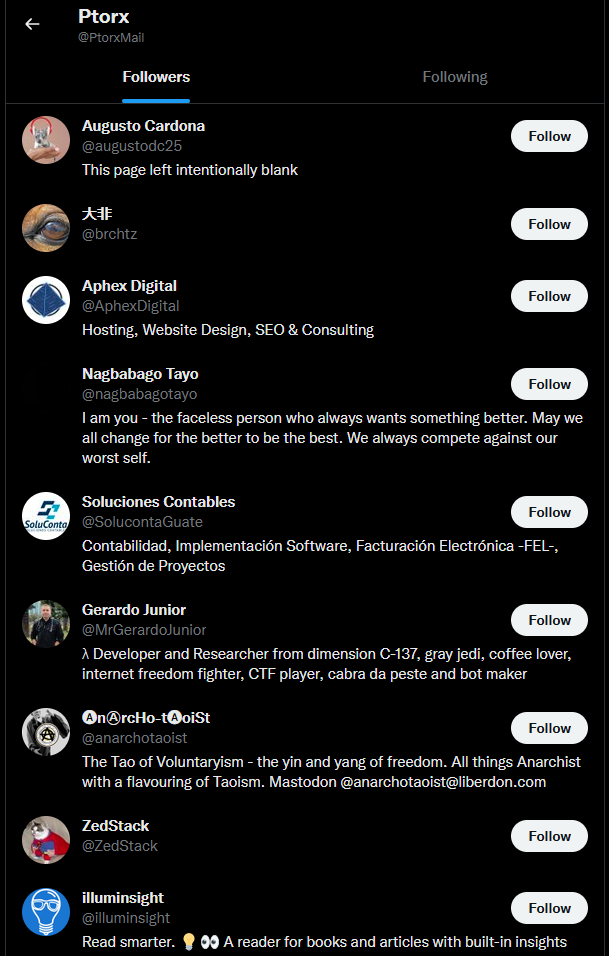

# Fan Mail

## Amusing selections from my hate/spam mail.

---

## An Adorable Attempt at Extortion

> "Be careful what you fish for."

- I received a strange e-mail a couple of months ago which motivated me to do a bit of detective work to see what I could find out about the source of the message.
- As I am now fairly confident that I have determined the source I felt that it would be amusing to publicize this information in the hope that the suspect shits himself if/when he sees this and realizes that he dun goofed.
- Admittedly I could be mistaken, and offer my apologies if that is so, but all signs seem to point to the conclusion I have found with high probability.
- All information has been forwarded to authorities as well as to a few acquaintances who enjoy this sort of thing and are eager to assist.
- Some information has been publicly omitted but is available in an encrypted file which is included at `/encrypted/MrXyfir.json`.
	- If you would like the decryption key then e-mail me with a short message explaining your intentions: mwtheta@protonmail.com


## Table of Contents

- <a href="#timeline-of-events">Timeline of Events</a>

- <a href="#personal-details-of-suspect">Personal Details of Suspect</a>

- <a href="#message-received">Message Received</a>

- <a href="#screenshots">Screenshots</a>

- <a href="#possible-retaliation-against-me">Possible Retaliation Against Me</a>


## Timeline of Events

- It's possible that MrXyfir (& comrades?) had been following me before the events recounted below, and that this all started with an error on his part.
	- This could make sense of a few things, including: 
		- 4+ sources consistently cloning all of my projects when I update them.
		- Unusual numbers of clones which I sometimes get on repositories like cata-list:
			- March 19, 2022: 37,051 (4 unique)
			- March 25, 2022: 32,270 (4 unique)
			- June 2, 2022: 38,978 (4 unique)
			- June 6, 2022: 33,955 (5 unique)
- **It begins**: April 20 2022 I logged into GitHub and saw a notification that on April 18 <a href="https://github.com/MrXyfir" target="_blank">MrXyfir</a> had started following my account.
- A few days later after logging in again I noticed that <a href="https://github.com/MrXyfir" target="_blank">MrXyfir</a> had unfollowed me.
	- Had he followed me by mistake?
	- Had he seen something which he did not like?
		- Perhaps my <a href="https://github.com/xnhl/riots" target="_blank">riots</a> project?
			- My personal archives of repository info (with views, clones, et cetera) reveal that there was one view of my riots project on April 18 (the day <a href="https://github.com/MrXyfir" target="_blank">MrXyfir</a> began following me).
			- MrXyfir may have personal connections in Portland.
				- See list below of some users he follows on GitHub which include a couple small users in Portland
		- I imagine that <a href="https://cata-list.github.io" target="_blank">cata-list</a> has also earned me some enemies and could be a possibility.
			- cata-list includes several dedicated anti-China pages (anti-government, not people)
				- My personal archives of repository info reveal that there were 5 views of my cata-list/reddit/china page on March 16 2022.
					- Roughly a month before the message I received on April 18.
				- <a href="https://github.com/MrXyfir" target="_blank">MrXyfir</a> may have personal connections in China (see GitHub details below).
					- If he is sympathetic with China then this is potential motivation to extort me.
					- I went through many pages of users whom he follows and it seems the majority with location details are located in China.
				- I'm curious how much the engagement with this repository will change when I write the words [Tiananmen Square](https://en.wikipedia.org/wiki/Tiananmen_Square).
		- My public support of the Canadian truckers' Freedom Convoy & protests (2022) on Twitter account for cata-list
	- Presumably, this is when he began plotting his genius 4D-chess strategy to extort me.
- I thought nothing more of this until 19 days later on May 7 when I received the <a href="#message-received">strange e-mail</a> from a truly dizzying intellect.
	- The first thing which struck me about the e-mail was the sender/return address: mwtheta@mwtheta.net
		- Address does not exist which reveals that the skillset of the sender includes spoofing addresses and anonymously sending e-mail.
- Recalling the recent and strange follow/unfollow of <a href="https://github.com/MrXyfir" target="_blank">MrXyfir</a> I checked out his GitHub page and found that one of his pinned repositories is <a href="https://github.com/xyfir/ptorx" target="_blank">ptorx</a> which is owned by <a href="https://github.com/xyfir" target="_blank">xyfir</a> (which he also presumably operates).
	- <a href="https://github.com/xyfir/ptorx" target="_blank">ptorx</a> enables users to: "Send and receive mail without using your real email address", "Anonymously forward and send mail with email forwarding and aliases".
		- <a href="https://www.youtube.com/watch?v=3YmMNpbFjp0" target="_blank">thatwaseasy.mp3</a>
- No other e-mail was received at Protonmail address for months before/after this message.
	- Another reason to believe that these events are connected.
- <a href="https://github.com/MrXyfir" target="_blank">MrXyfir</a> seems to be the only reasonable suspect at this time.
- July 23 2022: 9 days after creation of this document
	- **Probable confirmation**
	- Shortly after I began making a list of users who <a href="https://github.com/MrXyfir" target="_blank">MrXyfir</a> follows on GitHub I realized that the number was increasing at a rate of several per minute.
		- It was ~100 when I first noticed, ~400 when I checked back a couple of hours later, ~1,200 when I checked back again a few hours later.
			- ~2,900 in screenshot from days ago.
		- This change indicates:
			- Awareness of observation.
			- Desire / attempt to obfuscate this information.
				- What is he trying to hide?
			- He created a way to programatically remove all people he is following and then add them all again (repeating?).
	- I have received no new messages.
		- If he were entirely innocent and my allegations were absurd:
			- Expected reaction: Some kind of message: "I understand your motivation but you're way off."
			- Actual reaction:
				- Noticed he is being observed.
				- Created process to remove his GitHub "following" list and then add them again (possibly repeating the process).
				- Possibly/probably cloned a bunch of my projects. 
					- See <a href="#possible-retaliation-against-me">Possible Retaliation Against Me</a>
	- Awareness of observation + information obfuscation + no new messages
		- Seems to offer further confirmation that I'm correct.
			- However, continued action suggests that, rather than acknowledging defeat, he would prefer to see just how deep he can dig that grave.
				- FAFO
	- I added:
		- A bunch of screenshots and details regarding GitHub users <a href="https://github.com/MrXyfir" target="_blank">MrXyfir</a> follows (see below).
		- New main section: <a href="#possible-retaliation-against-me">Possible Retaliation Against Me</a>
- Further developments will follow.


## Personal Details of Suspect

- Possible identities:
	- **Christopher Fietz**
	- Koichi Matsumoto
	- Group/team rather than individual?
- Location
	- GitHub page and Twitter say California, United States.
		- https://github.com/MrXyfir
		- https://twitter.com/MrXyfir
	- Possible LinkedIn profile says Calgary, Alberta, Canada
		- https://ca.linkedin.com/in/cwfietz
		- Could be dual citizen. 
	- Japan a possibility (specifically Tokyo)?
		- See connection with <a href="https://github.com/mzch" target="_blank">Koichi Matsumoto</a>
- Occupation:
	- Developer? GitHub repositories indicate experience with React.
	- LinkedIn for Christopher Fietz indicates experience with React.
		- See screenshot or link: https://ca.linkedin.com/in/cwfietz
		- Also says he works as a "Full Stack Software Developer"
		- Therefore: GitHub and LinkedIn info match and strongly suggest connection.
- <a href="#message-received">Writing sample.</a>
- Adorable bluffing skills of a small child.
- Possibly a <a href="https://www.urbandictionary.com/define.php?term=furry" target="_blank">furry</a> (see details and screenshots below).
	- Probable <a href="https://ca.linkedin.com/in/cwfietz" target="_blank">LinkedIn page</a> says that he is "Starting with Absorb Software Inc. 2022 January".
		- I wonder if his current coworkers aware of any of his fantasies or his secret life as a 1337 h4x0r.
			- I imagine that they would like to be if they aren't already.
- Able and willing to send spoofed / anonymous e-mail.
- <a href="https://github.com/MrXyfir/npm-download-faker" target="_blank">npm-download-faker</a> repository reveals willingness to create fake information for personal gain.
- Willingness to extort strangers.
	- Presumably based on differing political views, in this case.
- Username (Mr. Cypher) and plain black GitHub avatar suggest desire to conceal personal information.
	- Reasonable in the time / society we live in, but suggestive in light of other details like attempted extortion.
- Moderate understanding of English (judging by received e-mail), but it seems likely that it is his second language which suggests that he is not white.
	- If working as team (as ptorx contributors list suggests) then perhaps Koichi Matsumoto wrote the message while Christopher Fietz is doing other work.
	- Surname of known associate is Matsumoto (Japanese). Perhaps <a href="https://github.com/MrXyfir" target="_blank">MrXyfir</a>/<a href="https://github.com/xyfir" target="_blank">xyfir</a> is Japanese as well.
- Somewhat versed in cryptocurrency usage (at least Bitcoin).
	- Bitcoin wallet (for tracking past/future use): bc1q033cjppaea0c2xvw6mwz7c3uf2f3dt9y9ssrx6
	- Made at least ~$3,472 in trades (Bitcoin for Amazon / other gift card balances) with other users on Reddit (see below)
	- Bitcoin drastic value loss = potential motivation for initial message to me?
		- Over roughly past 6 months Bitcoin has lost about half of its value
		- A drastic loss started April 18 2022 after a significant loss of about $3,000 just weeks before that.
			- 19 days before message to me
			- Day MrXyfir began following me on GitHub
			- See plateau on chart on April 17 2022 before drop
			- On May 7 2022 (date of received e-mail) chart shows start of a plateau at a new low point
			- See screenshot of bitcoinity website chart
			- ~$41,000 before recent decline, now ~$20,700
			- Link: https://data.bitcoinity.org/markets/price_volume/6m/USD?t=lb&vu=curr
- Other Links
	- Official website: https://www.xyfir.com/
	- GitHub gists: https://gist.github.com/MrXyfir
	- Keybase: https://keybase.io/xyfir
	- Fiverr: https://www.fiverr.com/mrxyfir
	- bytemeta: https://bytemeta.vip/@MrXyfir
	- Crunchbase: https://www.crunchbase.com/organization/xyfir
	- Ptorx Website: https://alias.gdn/info
	- npm packages: https://www.npmjs.com/~xyfir
- An e-mail address: mr@xyfir.com
	- Used to push to a repository
	- I believe anything@xyfir.com should reach him since he owns the domain.
- GitHub: List of some users <a href="https://github.com/MrXyfir" target="_blank">MrXyfir</a> follows (sorted by location):
	- July 23 2022 I looked through a few pages and made some notes and <a href="#screenshots">screenshots</a>.
	- China
		- Seems to be location of overwhelming majority of users he follows.
	- Portland, Oregon (2+)
		- <a href="https://github.com/mendozaline">mendozaline</a>
			- David Mendoza
			- Portland, Oregon
			- <a href="https://github.com/MrXyfir" target="_blank">MrXyfir</a> is one of only 2 followers
			- Not following anyone currently
		- <a href="https://github.com/micahjon">micahjon</a>
			- Micah Engle-Eshleman
			- Portland, Oregon
			- <a href="https://github.com/MrXyfir" target="_blank">MrXyfir</a> is one of only 10 followers
			- Not following <a href="https://github.com/MrXyfir" target="_blank">MrXyfir</a> currently
	- California, (10+)
		- Many in Los Angeles and Bay Area
		- Others in Irvine, Oakland, Thousand Oaks, Claremont, Sunnyvale.
		- <a href="https://github.com/musicbender">musicbender</a>
			- Pat Jacobs
			- Orange County, CA
			- <a href="https://github.com/MrXyfir" target="_blank">MrXyfir</a> is one of only 7 followers
			- Not following <a href="https://github.com/MrXyfir" target="_blank">MrXyfir</a> currently
		- <a href="https://github.com/MichaelManhire">MichaelManhire</a>
			- Michael Manhire
			- Orange, CA
			- <a href="https://github.com/MrXyfir" target="_blank">MrXyfir</a> is one of only 2 followers
			- Not following anyone currently
	- California / Portland:
		- 4+ small accounts each with 10 or fewer followers of which <a href="https://github.com/MrXyfir" target="_blank">MrXyfir</a> is one.
			- Could indicate that he personally knows them.
		- Could <a href="https://github.com/MrXyfir" target="_blank">MrXyfir</a> be close to Orange / Orange County?
		- Portland, Oregon is central to the BLM / "<a href="https://www.youtube.com/watch?v=81k93Guu-Oc">Antifa</a>" LARPing & riots which my GitHub <a href="https://github.com/xnhl/riots" target="_blank">repository</a> was directly about.
- Reddit account: https://www.reddit.com/user/MrXyfir
	- Some potentially interesting things happening there.
		- Member since January 2, 2016
		- Was a mod of Gift Card Trading (GCTrading) subreddit:  https://www.reddit.com/r/GCTrading/
		- Also at least a member of subreddit Gift Card Trading Rep (GCTRep):  https://www.reddit.com/r/GCTRep/
		- Traded Bitcoin / Amazon balances with other users
			- https://www.reddit.com/user/podgoorsky/
			- https://www.reddit.com/user/freshnupwithme/
			- Stats say ~$3,472 in trades since January 2, 2016
			- Indicates knowledge of Bitcoin usage.
				- This fits nicely with the e-mail which I received.
					- <a href="https://github.com/MrXyfir" target="_blank">MrXyfir</a>/<a href="https://github.com/xyfir" target="_blank">xyfir</a> kindly requests "$1370 USD" to be sent to "my bitcoin wallet provided below: bc1q033cjppaea0c2xvw6mwz7c3uf2f3dt9y9ssrx6"
- The Tolkien Forum: https://www.thetolkienforum.com/members/mrxyfir.16326/
- Fandom account:
	- A Wheel of Time: https://wot.fandom.com/wiki/User:MrXyfir
	- (Kingkiller Series): https://kingkiller.fandom.com/wiki/User:MrXyfir
		- Motivation to become involved with the community for a series of novels suggests that it made a strong positive impact on him.
			- This suggests support for / identification with <a href="https://kingkiller.fandom.com/wiki/Kvothe" target="_blank">Kvothe</a> (the hero and protagonist), though, ironically, extortion would seem to suggest <a href="https://github.com/MrXyfir" target="_blank">MrXyfir</a> is more of an <a href="https://kingkiller.fandom.com/wiki/Ambrose_Jakis" target="_blank">Ambrose</a> (an antagonist & bully).
			- I have also read and enjoyed the series (not for the purposes of this document) and so understand the characters.
- Twitter:
	- https://twitter.com/MrXyfir
		- Location: California, USA
		- <a href="#screenshots">Screenshots</a> below
		- Only Tweet: https://twitter.com/MrXyfir/status/1141013259887108097
			- 11 likes
				- <a href="https://twitter.com/darkpixlz" target="_blank">darkpixlz</a> (furry)
				- <a href="https://twitter.com/NobleFurLyfe" target="_blank">NobleFurLyfe</a> (furry)
				- <a href="https://twitter.com/megamastermanu" target="_blank">megamastermanu</a>
				- <a href="https://twitter.com/sha_tiw" target="_blank">sha_tiw</a>
				- <a href="https://twitter.com/Devtubel" target="_blank">Devtubel</a>
				- <a href="https://twitter.com/TomatDividedBy0" target="_blank">TomatDividedBy0</a> ("vaguely ultra-left")
				- <a href="https://twitter.com/k3llydev" target="_blank">k3llydev</a>
				- <a href="https://twitter.com/lowfry" target="_blank">lowfry</a>
				- <a href="https://twitter.com/PtorxMail" target="_blank">PtorxMail</a> (liked his own tweet)
				- <a href="https://twitter.com/kojo_Swain" target="_blank">kojo_Swain</a>
				- <a href="https://twitter.com/MrXyfir" target="_blank">MrXyfir</a> (liked his own tweet)
		- Followers: <a href="https://twitter.com/oevrhgczAPcyoNf" target="_blank">oevrhgczAPcyoNf</a>, <a href="https://twitter.com/Soeparmadi" target="_blank">Soeparmadi</a>, <a href="https://twitter.com/dedhex_07" target="_blank">dedhex_07</a>, <a href="https://twitter.com/Cynethic" target="_blank">Cynethic</a>, <a href="https://twitter.com/yeahwemadeout" target="_blank">yeahwemadeout</a>, <a href="https://twitter.com/ditoruncausO" target="_blank">ditoruncausO</a>, <a href="https://twitter.com/Maxx464" target="_blank">Maxx464</a>, <a href="https://twitter.com/TetrAbysmal" target="_blank">TetrAbysmal</a>, <a href="https://twitter.com/NahuelDMt" target="_blank">NahuelDMt</a>, <a href="https://twitter.com/Scdingo1" target="_blank">Scdingo1</a>, <a href="https://twitter.com/blair_pass" target="_blank">blair_pass</a>, <a href="https://twitter.com/czwsaxde" target="_blank">czwsaxde</a>, <a href="https://twitter.com/ItsWilliam77" target="_blank">ItsWilliam77</a>, <a href="https://twitter.com/Ruz60908488" target="_blank">Ruz60908488</a>, <a href="https://twitter.com/NouSomeone" target="_blank">NouSomeone</a>, <a href="https://twitter.com/Emma__McCaw" target="_blank">Emma__McCaw</a>, <a href="https://twitter.com/rootslashbin" target="_blank">rootslashbin</a>, <a href="https://twitter.com/Husky_NZ" target="_blank">Husky_NZ</a>, <a href="https://twitter.com/jonasqalolino" target="_blank">jonasqalolino</a>, <a href="https://twitter.com/whosurkolchan" target="_blank">whosurkolchan</a>, <a href="https://twitter.com/Hel_lmYXX" target="_blank">Hel_lmYXX</a>, <a href="https://twitter.com/edon_palenchar" target="_blank">edon_palenchar</a>, <a href="https://twitter.com/_hopa_" target="_blank">_hopa_</a>, <a href="https://twitter.com/ClownMeebus" target="_blank">ClownMeebus</a>, <a href="https://twitter.com/JoeHan04889221" target="_blank">JoeHan04889221</a>, <a href="https://twitter.com/texaglo_techno" target="_blank">texaglo_techno</a>, <a href="https://twitter.com/MaloneyTyler" target="_blank">MaloneyTyler</a>, <a href="https://twitter.com/bieronym" target="_blank">bieronym</a>, <a href="https://twitter.com/NiklasInde" target="_blank">NiklasInde</a>, <a href="https://twitter.com/k3llydev" target="_blank">k3llydev</a>, <a href="https://twitter.com/jpoiatti" target="_blank">jpoiatti</a>, <a href="https://twitter.com/oivoodoo" target="_blank">oivoodoo</a>, <a href="https://twitter.com/w3debugger" target="_blank">w3debugger</a>, <a href="https://twitter.com/botykai_zsolt" target="_blank">botykai_zsolt</a>, <a href="https://twitter.com/alberto1el" target="_blank">alberto1el</a>, <a href="https://twitter.com/akaash19031973" target="_blank">akaash19031973</a>, <a href="https://twitter.com/flocca" target="_blank">flocca</a>, <a href="https://twitter.com/ivanhigueram" target="_blank">ivanhigueram</a>, <a href="https://twitter.com/Skarlso" target="_blank">Skarlso</a>, <a href="https://twitter.com/m4pp3rr" target="_blank">m4pp3rr</a>, <a href="https://twitter.com/emaraschio" target="_blank">emaraschio</a>, <a href="https://twitter.com/Bocard23" target="_blank">Bocard23</a>, <a href="https://twitter.com/iamshouvikmitra" target="_blank">iamshouvikmitra</a>, <a href="https://twitter.com/hoyes" target="_blank">hoyes</a>, <a href="https://twitter.com/dancarl857" target="_blank">dancarl857</a>, <a href="https://twitter.com/rounakdatta12" target="_blank">rounakdatta12</a>, <a href="https://twitter.com/TRex2218" target="_blank">TRex2218</a>, <a href="https://twitter.com/Finskou" target="_blank">Finskou</a>, <a href="https://twitter.com/vimfrw" target="_blank">vimfrw</a>, <a href="https://twitter.com/luukverhoeven" target="_blank">luukverhoeven</a>, <a href="https://twitter.com/illuminsight" target="_blank">illuminsight</a>, <a href="https://twitter.com/enullopa" target="_blank">enullopa</a>, <a href="https://twitter.com/xwellium" target="_blank">xwellium</a>, <a href="https://twitter.com/andrejnano" target="_blank">andrejnano</a>, <a href="https://twitter.com/PtorxMail" target="_blank">PtorxMail</a>
	- Possible alternate: https://twitter.com/xyfir
		- Unique name matches: xyfir
		- Full-stack developer
			- Matches other info about <a href="https://github.com/MrXyfir" target="_blank">MrXyfir</a>/<a href="https://github.com/xyfir" target="_blank">xyfir</a>.
				- Low probability that this is merely chance.
		- If this is <a href="https://github.com/MrXyfir" target="_blank">MrXyfir</a>/<a href="https://github.com/xyfir" target="_blank">xyfir</a>, then:
			- Legal name: **Christopher Fietz**
			- Possible LinkedIn account: https://ca.linkedin.com/in/cwfietz
				- See <a href="#screenshots">screenshots</a>
				- Full-stack developer
				- Location: Calgary, Alberta, Canada
					- Does not match other data, but:
						- Only 3 other Christopher Fietz on LinkedIn
						- Web search "christopher fietz developer full stack" gives this account as first result
						- Potential motive if <a href="https://github.com/MrXyfir" target="_blank">MrXyfir</a>/<a href="https://github.com/xyfir" target="_blank">xyfir</a> is Canadian: I publicly supported the Canadian truckers' Freedom Convoy & protests (2022) via my Twitter account for cata-list
							- Many/most supporters who sent money to organizations helping them were doxxed and then predictably harassed by journalists and others (as was the point).
				- Lack of profile image (or at least not publicly visible)
					- Could indicate caring about privacy more than the average person.
					- Benign unless coupled with facts like attempted extortion.
					- Recall plain black GitHub image for <a href="https://github.com/MrXyfir" target="_blank">MrXyfir</a>/<a href="https://github.com/xyfir" target="_blank">xyfir</a>
	- Possible alternate: https://twitter.com/Xyfir1Xyfir
		- Username is Xyfir.
		- Account name includes Xyfir.
		- Account created May 2022.
			- E-mail received May 7, 2022.
		- Avatar is plain white as others are plain black.
		- Tweets are protected / hidden.
		- 0 following / followers.
		- Seems probable that this is <a href="https://github.com/MrXyfir" target="_blank">MrXyfir</a>/<a href="https://github.com/xyfir" target="_blank">xyfir</a>.
	- Ptorx Twitter: https://twitter.com/PtorxMail
		- Location: California, USA
		- Following MrXyfir
		- Followers: <a href="https://twitter.com/augustodc25" target="_blank">augustodc25</a>, <a href="https://twitter.com/brchtz" target="_blank">brchtz</a>, <a href="https://twitter.com/AphexDigital" target="_blank">AphexDigital</a>, <a href="https://twitter.com/nagbabagotayo" target="_blank">nagbabagotayo</a>, <a href="https://twitter.com/SolucontaGuate" target="_blank">SolucontaGuate</a>, <a href="https://twitter.com/MrGerardoJunior" target="_blank">MrGerardoJunior</a>, <a href="https://twitter.com/anarchotaoist" target="_blank">anarchotaoist</a>, <a href="https://twitter.com/ZedStack" target="_blank">ZedStack</a>, <a href="https://twitter.com/illuminsight" target="_blank">illuminsight</a>, <a href="https://twitter.com/simran46271059" target="_blank">simran46271059</a>
- Association with Koichi Matsumoto
	- Only other contributor to <a href="https://github.com/xyfir/ptorx" target="_blank">ptorx</a> beside <a href="https://github.com/xyfir" target="_blank">xyfir</a>
	- GitHub account: <a href="https://github.com/mzch" target="_blank">mzch</a>
	- Possible LinkedIn account: https://jp.linkedin.com/in/koichimatsumotoprofile
		- Details match expectations: Frontend Developer in Tokyo, Japan.
	- If he is not <a href="https://github.com/MrXyfir" target="_blank">MrXyfir</a>/<a href="https://github.com/xyfir" target="_blank">xyfir</a> then he probably knows who is.
- Strong focus on sexual strategy for extortion
	- Could just be the easy and common route.
	- Could suggest that his accusations are confession through projection and he has got some weird shit going on in that cavernous cranium.
	- The first two Twitter users who liked MrXyfir's only tweet are self-identified furries (see screenshot)
		- <a href="https://twitter.com/Pixlz" target="_blank">Pixlz</a>, <a href="https://twitter.com/NobleFurLyfe" target="_blank">NobleFurLyfe</a>
		- What is a furry?: https://www.urbandictionary.com/define.php?term=furry
		- Does not mean that MrXyfir is a furry, but considering that the first two likes on his only tweet are from self-identifying furries I imagine that it is a strong possibility.
			- MrXyfur(ry)?
			- Could at least partially explain secretive nature.
			- [(o_0)!](https://www.youtube.com/watch?v=_dz4EmuN7-c)
- Unique, noteworthy, identifying words/phrases/et cetera
	- (o_0)!
	- "Owh"
		- Alternate / misspelling of "Oh"?
		- Could possibly be common and reveal info about culture / location.
	- "Everything ingenious is quite simple"
	- "I purchased from hackers the access to multiple email accounts"
		- Admission of guilt / breaking the law.
	- "I installed Trojan virus in Operating Systems of all devices of yours"
		- Admission of guilt / breaking the law.
	- "Virus of mine constantly keeps refreshing its signatures (because it is driver-based)"
		- Admission that he uses/designs viruses.
	- "my trojan virus allows me to control remotely your devices, same as TeamViewer"
		- Admission of guilt / breaking the law.
		- May indicate past experience with this kind of thing ("...same as TeamViewer")
	- "Do not try searching for me – there is absolutely no reason to do that"
		- LOL. Just very amusing.
	
## Possible Retaliation Against Me
- Spoofing e-mail + faking information for personal gain + willingness to extort others + failure to fool/harm me suggest some things.
- He (& comrades?) may attempt to create fake information about me and make it public (especially if all else fails).
- He (& comrades?) may clone my GitHub projects and try to claim them as his/their own for profit.
	- Recall probable sympathy with China (and their infamous history of IP theft).
	- This could be supported by recent history of clones of my repositories.
		- On July 17 2022 (3 days after creation of this document) MrXyfir created a fork of yargs/yargs
			- https://github.com/MrXyfir/yargs
			- yargs is used to build interactive command line tools
		- On July 19 2022 (5 days after creation of this document) there was an unusual pattern of clones across several of my projects.
			- Bookmarks-Map: 2 (1 unique source(s))
				- Command line tool
			- Bookmarks-Map-Website: 2 (1 unique source(s))
				- Built from command line tool
			- Open-Movie-Database-Svelte: 2 (1 unique source(s))
			- Open-Movie-Database: 4 (1 unique source(s))
			- Sam-Harris-Videos: 2 (1 unique source(s))
			- Sounds: 2 (1 unique source(s))
			- Tools-Svelte: 4 (1 unique source(s))
			- notes-app-svelte: 4 (1 unique source(s))
			- notes-app: 2 (1 unique source(s))
			- periodic-table: 4 (1 unique source(s))
			- time-tracker: 2 (1 unique source(s))
			- VuePress: 1 (1 unique source(s))
			- boilerplate-scrape: 3 (2 unique source(s))
			- **Conclusion**: Possible that 1 source cloned 12 or 13 of my projects and will attempt to profit from them or claim them as their own.
		- On July 22 2022 (8 days after creation of this document) there was a clone of my portfolio repository.
			- Unusual because project has not been updated since July 7 2022 (about 2 weeks ago).
			- I updated my portfolio (GitHub pages repository) that day.
				- Presumably he cloned this repository as well.
			- Suggests that he may attempt to extract and claim my content as his own for profit.
		- On July 23 2022 (9 days after creation of this document) there were clones of projects which have not been updated for at least a few days.
			- cata-list.github.io: 2 (1 unique source(s))
				- Last update: July 20, 2022 (3 days ago)
			- boilerplate-vuepress: 1 (1 unique source(s))
				- Last update: June 21, 2022 (about a month ago)
			- encrypted: 1 (1 unique source(s))
				- Last update: May 15, 2022 (roughly two months ago)
					- Added new key/data but same meaningless Lorem Ipsum as before.
				- Update before last contains keys to decrypt data.
					- Decrypted data is meaningless Lorem Ipsum.
				- Project was created as a kind of test/prank to see what information I could potentially derive (if any) about the 4+ sources who have been consistently cloning all my repositories.
					- 13 clones (4 unique source(s)) on day of revealing the joke (April Fool's Day 2022)
			- There have also been many clones recently of my boilerplate-scrape repository.
				- At least 5 unique sources.
			- **Conclusion**: Possible that 1 source cloned many/all of these projects and will attempt to profit from them or claim them as their own.


## Message Received
```
Don’t forget to pay the tax within 2 days!

From: mwtheta@mwtheta.net <mwtheta@mwtheta.net>

To: mwtheta@protonmail.com

Date: Saturday, May 7th, 2022 at 12:14 AM

Hi. How are you?

I know, it’s unpleasant to start the conversation with bad news, but I have no choice.
Few months ago, I have gained access to your devices that used by you for internet browsing.
Afterwards, I could track down all your internet activities.

Here is the history of how it could become possible:
At first, I purchased from hackers the access to multiple email accounts (nowadays, it is a really simple thing to do online).
As result, I could easily log in to your email account (-).

One week later, I installed Trojan virus in Operating Systems of all devices of yours, which you use to open email.
Frankly speaking, it was rather straightforward (since you were opening the links from your inbox emails).
Everything ingenious is quite simple. (o_0)!

My software enables me with access to all controllers inside devices of yours, like microphone, keyboard and video camera.
I could easily download to my servers all your private info, including the history of web browsing and photos.
I can effortlessly gain access to all your messengers, social networks accounts, emails, contact list as well as chat history.
Virus of mine constantly keeps refreshing its signatures (because it is driver-based), and as result remains unnoticed by your antivirus.

Hence, you can already guess why I stayed undetected all this while.

As I was gathering information about you, I couldn’t help but notice that you are also a true fan of adult-content websites.
You actually love visiting porn sites and browsing through kinky videos, while pleasuring yourself.
I could make a few dirty records with you in the main focus and montaged several videos showing the way you reach orgasm while masturbating with joy.

If you are still uncertain regarding the seriousness of my intentions,
it only requires several mouse clicks for me to forward your videos to all your relatives, as well as friends and colleagues.
I can also make those vids become accessible by public.
I honestly think that you do not really want that to happen, considering the peculiarity of videos you like to watch,
(you obviously know what I mean) all that kinky content can become a reason of serious troubles for you.

However, we can still resolve this situation in the following manner:
Everything you are required to do is a single transfer of $1370 USD to my account (or amount equivalent to bitcoin depending on exchange rate at the moment of transfer),
and once the transaction is complete, I will straight away remove all the dirty content exposing you.
After that, you can even forget that you have come across me. Moreover, I swear that all the harmful software will be removed from all devices of yours as well.
Make no doubt that I will fulfill my part.

This is really a great deal that comes at a reasonable price, given that I have used quite a lot of energy to check your profile as well as traffic over an extended period of time.
If you have no idea about bitcoin purchase process – it can be straightforwardly done by getting all the necessary information online.

Here is my bitcoin wallet provided below: bc1q033cjppaea0c2xvw6mwz7c3uf2f3dt9y9ssrx6

You should complete the abovementioned transfer within 48 hours (2 days) after opening this email.

The following list contains actions you should avoid attempting:
#Do not try replying my email (email in your inbox was generated by me alongside with return email address).
#Do not try calling police as well as other security forces. In addition, abstain from sharing this story with your friends.
After I find out (be sure, I can easily do that, given that I keep complete control of all your devices) – your kinky video will end up being available to public right away.
#Do not try searching for me – there is absolutely no reason to do that. Moreover, all transactions in cryptocurrency are always anonymous.
#Do not try reinstalling the OS on your devices or throwing them away. It is pointless as well, since all your videos have already been uploaded to remote servers.

The following list contains things you should not be worried about:
#That your money won’t reach my account.
– Rest assured, the transactions can be tracked, hence once the transaction is complete,
I will know about it, because I continuously observe all your activities (my trojan virus allows me to control remotely your devices, same as TeamViewer).
#That I still will share your kinky videos to public after you complete money transfer.
– Trust me, it’s pointless for me to continue troubling your life. If I really wanted, I would make it happen already!

Let’s make this deal in a fair manner!

Owh, one more thing…in future it is best that you don’t involve yourself in similar situations any longer!
One last advice from me – recurrently change all your passwords from all accounts.
```

## Screenshots
<figure style="margin: 1rem 1rem 2rem 1rem;">
	
	<figcaption>MrXyfir follow on April 18 2022</figcaption>
</figure>
<figure style="margin: 1rem 1rem 2rem 1rem;">
	
	<figcaption>E-mail on May 7 2022</figcaption>
</figure>
<figure style="margin: 1rem 1rem 2rem 1rem;">
	
	<figcaption>MrXyfir location, some social media accounts</figcaption>
</figure>
<figure style="margin: 1rem 1rem 2rem 1rem;">
	
	<figcaption>MrXyfir pinned repositories (including ptorx)</figcaption>
</figure>
<figure style="margin: 1rem 1rem 2rem 1rem;">
	
	<figcaption>xyfir location, website, pinned repositories (including ptorx)</figcaption>
</figure>
<figure style="margin: 1rem 1rem 2rem 1rem;">
	
	<figcaption>MrXyfir repositories</figcaption>
</figure>
<figure style="margin: 1rem 1rem 2rem 1rem;">
	
	<figcaption>ptorx</figcaption>
</figure>
<figure style="margin: 1rem 1rem 2rem 1rem;">
	
	<figcaption>ptorx contributors</figcaption>
</figure>
<figure style="margin: 1rem 1rem 2rem 1rem;">
	
	<figcaption>xyfir logo</figcaption>
</figure>
<figure style="margin: 1rem 1rem 2rem 1rem;">
	
	<figcaption>MrXyfir Twitter</figcaption>
</figure>
<figure style="margin: 1rem 1rem 2rem 1rem;">
	
	<figcaption>MrXyfir Twitter Avatar</figcaption>
</figure>
<figure style="margin: 1rem 1rem 2rem 1rem;">
	
	<figcaption>MrXyfir Twitter Tweet</figcaption>
</figure>
<figure style="margin: 1rem 1rem 2rem 1rem;">
	
	<figcaption>MrXyfir Twitter Tweet Likes 1</figcaption>
</figure>
<figure style="margin: 1rem 1rem 2rem 1rem;">
	
	<figcaption>MrXyfir Twitter Tweet Likes 2</figcaption>
</figure>
<figure style="margin: 1rem 1rem 2rem 1rem;">
	
	<figcaption>MrXyfir Twitter Likes</figcaption>
</figure>
<figure style="margin: 1rem 1rem 2rem 1rem;">
	
	<figcaption>MrXyfir Twitter Followers 1</figcaption>
</figure>
<figure style="margin: 1rem 1rem 2rem 1rem;">
	
	<figcaption>MrXyfir Twitter Followers 2</figcaption>
</figure>
<figure style="margin: 1rem 1rem 2rem 1rem;">
	
	<figcaption>MrXyfir Twitter Followers 3</figcaption>
</figure>
<figure style="margin: 1rem 1rem 2rem 1rem;">
	
	<figcaption>MrXyfir Twitter Followers 4</figcaption>
</figure>
<figure style="margin: 1rem 1rem 2rem 1rem;">
	
	<figcaption>MrXyfir Twitter Followers 5</figcaption>
</figure>
<figure style="margin: 1rem 1rem 2rem 1rem;">
	
	<figcaption>MrXyfir Twitter Followers 6</figcaption>
</figure>
<figure style="margin: 1rem 1rem 2rem 1rem;">
	
	<figcaption>MrXyfir Twitter Followers 7</figcaption>
</figure>
<figure style="margin: 1rem 1rem 2rem 1rem;">
	
	<figcaption>MrXyfir Twitter (Alternate)</figcaption>
</figure>
<figure style="margin: 1rem 1rem 2rem 1rem;">
	
	<figcaption>Twitter xyfir</figcaption>
</figure>
<figure style="margin: 1rem 1rem 2rem 1rem;">
	
	<figcaption>xyfir Twitter Avatar</figcaption>
</figure>
<figure style="margin: 1rem 1rem 2rem 1rem;">
	
	<figcaption>Bitcoin Price (Last 6 months)</figcaption>
</figure>
<figure style="margin: 1rem 1rem 2rem 1rem;">
	
	<figcaption>Ptorx Twitter</figcaption>
</figure>
<figure style="margin: 1rem 1rem 2rem 1rem;">
	
	<figcaption>Ptorx Twitter Followers 1</figcaption>
</figure>
<figure style="margin: 1rem 1rem 2rem 1rem;">
	
	<figcaption>Ptorx Twitter Followers 2</figcaption>
</figure>
<figure style="margin: 1rem 1rem 2rem 1rem;">
	
	<figcaption>Ptorx Twitter Tweet 1</figcaption>
</figure>
<figure style="margin: 1rem 1rem 2rem 1rem;">
	
	<figcaption>Ptorx Twitter Tweet 2</figcaption>
</figure>
<figure style="margin: 1rem 1rem 2rem 1rem;">
	
	<figcaption>Ptorx Twitter Tweet 3</figcaption>
</figure>
<figure style="margin: 1rem 1rem 2rem 1rem;">
	
	<figcaption>Ptorx Twitter Tweet 4</figcaption>
</figure>
<figure style="margin: 1rem 1rem 2rem 1rem;">
	
	<figcaption>Ptorx Twitter Tweet 5</figcaption>
</figure>
<figure style="margin: 1rem 1rem 2rem 1rem;">
	
	<figcaption>Ptorx Twitter Tweet 6</figcaption>
</figure>
<figure style="margin: 1rem 1rem 2rem 1rem;">
	
	<figcaption>Ptorx Twitter Tweet Image</figcaption>
</figure>
<figure style="margin: 1rem 1rem 2rem 1rem;">
	
	<figcaption>Ptorx Twitter Avatar</figcaption>
</figure>
<figure style="margin: 1rem 1rem 2rem 1rem;">
	
	<figcaption>MrXyfir GitHub Follow 1</figcaption>
</figure>
<figure style="margin: 1rem 1rem 2rem 1rem;">
	
	<figcaption>MrXyfir GitHub Follow 2</figcaption>
</figure>
<figure style="margin: 1rem 1rem 2rem 1rem;">
	
	<figcaption>MrXyfir GitHub Follow 3</figcaption>
</figure>
<figure style="margin: 1rem 1rem 2rem 1rem;">
	
	<figcaption>MrXyfir GitHub Follow 4</figcaption>
</figure>
<figure style="margin: 1rem 1rem 2rem 1rem;">
	
	<figcaption>MrXyfir GitHub Follow 5</figcaption>
</figure>
<figure style="margin: 1rem 1rem 2rem 1rem;">
	
	<figcaption>MrXyfir GitHub Follow 6</figcaption>
</figure>
<figure style="margin: 1rem 1rem 2rem 1rem;">
	
	<figcaption>MrXyfir GitHub Follow 7</figcaption>
</figure>
<figure style="margin: 1rem 1rem 2rem 1rem;">
	
	<figcaption>MrXyfir GitHub Follow 8</figcaption>
</figure>
<figure style="margin: 1rem 1rem 2rem 1rem;">
	
	<figcaption>MrXyfir GitHub Follow 9</figcaption>
</figure>
<figure style="margin: 1rem 1rem 2rem 1rem;">
	
	<figcaption>MrXyfir GitHub Follow 10</figcaption>
</figure>
<figure style="margin: 1rem 1rem 2rem 1rem;">
	
	<figcaption>MrXyfir GitHub Follow 11</figcaption>
</figure>
<figure style="margin: 1rem 1rem 2rem 1rem;">
	
	<figcaption>MrXyfir GitHub Follow 12</figcaption>
</figure>
<figure style="margin: 1rem 1rem 2rem 1rem;">
	
	<figcaption>MrXyfir GitHub Follow 13</figcaption>
</figure>
<figure style="margin: 1rem 1rem 2rem 1rem;">
	
	<figcaption>MrXyfir GitHub Follow 14</figcaption>
</figure>
<figure style="margin: 1rem 1rem 2rem 1rem;">
	
	<figcaption>MrXyfir GitHub Follow 15</figcaption>
</figure>
<figure style="margin: 1rem 1rem 2rem 1rem;">
	
	<figcaption>MrXyfir GitHub Follow 16</figcaption>
</figure>
<figure style="margin: 1rem 1rem 2rem 1rem;">
	
	<figcaption>MrXyfir GitHub Follow 17</figcaption>
</figure>
<figure style="margin: 1rem 1rem 2rem 1rem;">
	
	<figcaption>MrXyfir GitHub Follow 18</figcaption>
</figure>
<figure style="margin: 1rem 1rem 2rem 1rem;">
	
	<figcaption>MrXyfir GitHub Follow 19</figcaption>
</figure>
<figure style="margin: 1rem 1rem 2rem 1rem;">
	
	<figcaption>MrXyfir GitHub Follow 20</figcaption>
</figure>
<figure style="margin: 1rem 1rem 2rem 1rem;">
	
	<figcaption>MrXyfir GitHub Follow 21</figcaption>
</figure>
<figure style="margin: 1rem 1rem 2rem 1rem;">
	
	<figcaption>MrXyfir GitHub Follow 22</figcaption>
</figure>
<figure style="margin: 1rem 1rem 2rem 1rem;">
	
	<figcaption>MrXyfir GitHub Follow 23</figcaption>
</figure>
<figure style="margin: 1rem 1rem 2rem 1rem;">
	
	<figcaption>MrXyfir GitHub Follow 24</figcaption>
</figure>
<figure style="margin: 1rem 1rem 2rem 1rem;">
	
	<figcaption>MrXyfir GitHub Follow 25</figcaption>
</figure>
<figure style="margin: 1rem 1rem 2rem 1rem;">
	
	<figcaption>MrXyfir GitHub Follow 26</figcaption>
</figure>
<figure style="margin: 1rem 1rem 2rem 1rem;">
	
	<figcaption>MrXyfir GitHub Follow 27</figcaption>
</figure>
<figure style="margin: 1rem 1rem 2rem 1rem;">
	
	<figcaption>MrXyfir GitHub Follow 28</figcaption>
</figure>
<figure style="margin: 1rem 1rem 2rem 1rem;">
	
	<figcaption>MrXyfir GitHub Follow 29</figcaption>
</figure>
<figure style="margin: 1rem 1rem 2rem 1rem;">
	
	<figcaption>MrXyfir GitHub Follow 30</figcaption>
</figure>
<figure style="margin: 1rem 1rem 2rem 1rem;">
	
	<figcaption>MrXyfir GitHub Follow 31</figcaption>
</figure>
<figure style="margin: 1rem 1rem 2rem 1rem;">
	
	<figcaption>MrXyfir GitHub Follow 32</figcaption>
</figure>
<figure style="margin: 1rem 1rem 2rem 1rem;">
	
	<figcaption>MrXyfir GitHub Follow 33</figcaption>
</figure>
<figure style="margin: 1rem 1rem 2rem 1rem;">
	
	<figcaption>MrXyfir GitHub Follow 34</figcaption>
</figure>
<figure style="margin: 1rem 1rem 2rem 1rem;">
	
	<figcaption>MrXyfir GitHub Follow 35</figcaption>
</figure>
<figure style="margin: 1rem 1rem 2rem 1rem;">
	
	<figcaption>MrXyfir GitHub Follow 36</figcaption>
</figure>
<figure style="margin: 1rem 1rem 2rem 1rem;">
	
	<figcaption>MrXyfir GitHub Follow 37</figcaption>
</figure>
<figure style="margin: 1rem 1rem 2rem 1rem;">
	
	<figcaption>MrXyfir GitHub Follow 38</figcaption>
</figure>
<figure style="margin: 1rem 1rem 2rem 1rem;">
	
	<figcaption>MrXyfir GitHub Follow 39</figcaption>
</figure>
<figure style="margin: 1rem 1rem 2rem 1rem;">
	
	<figcaption>MrXyfir GitHub Follow 40</figcaption>
</figure>
<figure style="margin: 1rem 1rem 2rem 1rem;">
	
	<figcaption>MrXyfir GitHub Follow 41</figcaption>
</figure>
<figure style="margin: 1rem 1rem 2rem 1rem;">
	
	<figcaption>MrXyfir GitHub Follow 42</figcaption>
</figure>
<figure style="margin: 1rem 1rem 2rem 1rem;">
	
	<figcaption>MrXyfir GitHub Follow 43</figcaption>
</figure>
<figure style="margin: 1rem 1rem 2rem 1rem;">
	
	<figcaption>MrXyfir GitHub Follow 44</figcaption>
</figure>
<figure style="margin: 1rem 1rem 2rem 1rem;">
	
	<figcaption>MrXyfir GitHub Follow 45</figcaption>
</figure>
<figure style="margin: 1rem 1rem 2rem 1rem;">
	
	<figcaption>MrXyfir GitHub Follow 46</figcaption>
</figure>
<figure style="margin: 1rem 1rem 2rem 1rem;">
	
	<figcaption>MrXyfir GitHub Follow 47</figcaption>
</figure>
<figure style="margin: 1rem 1rem 2rem 1rem;">
	
	<figcaption>MrXyfir GitHub Follow 48</figcaption>
</figure>
<figure style="margin: 1rem 1rem 2rem 1rem;">
	
	<figcaption>MrXyfir GitHub Follow 49</figcaption>
</figure>
<figure style="margin: 1rem 1rem 2rem 1rem;">
	
	<figcaption>MrXyfir GitHub Follow 50</figcaption>
</figure>
<figure style="margin: 1rem 1rem 2rem 1rem;">
	
	<figcaption>MrXyfir GitHub Follow 51</figcaption>
</figure>
<figure style="margin: 1rem 1rem 2rem 1rem;">
	
	<figcaption>MrXyfir GitHub Follow 52</figcaption>
</figure>
<figure style="margin: 1rem 1rem 2rem 1rem;">
	
	<figcaption>MrXyfir GitHub Follow 53</figcaption>
</figure>
<figure style="margin: 1rem 1rem 2rem 1rem;">
	
	<figcaption>MrXyfir Reddit 1</figcaption>
</figure>
<figure style="margin: 1rem 1rem 2rem 1rem;">
	
	<figcaption>MrXyfir Reddit 2</figcaption>
</figure>
<figure style="margin: 1rem 1rem 2rem 1rem;">
	
	<figcaption>MrXyfir Reddit 3</figcaption>
</figure>
<figure style="margin: 1rem 1rem 2rem 1rem;">
	
	<figcaption>MrXyfir Reddit 4</figcaption>
</figure>
<figure style="margin: 1rem 1rem 2rem 1rem;">
	
	<figcaption>LinkedIn - Christopher Fietz</figcaption>
</figure>
<figure style="margin: 1rem 1rem 2rem 1rem;">
	
	<figcaption>LinkedIn - Koichi Matsumoto</figcaption>
</figure>
